# Implementation Plan: Per-Principal PKI Authentication with Mutual TLS

## Summary

Replace the current single shared JWT public key authentication model with a per-principal PKI model using **mutual TLS (mTLS)** where each user/worker maintains their own ECDSA P-256 key pair and X.509 certificate. This enables distributed credential management, automatic certificate rotation, per-principal revocation capabilities, and provides message integrity and replay protection via TLS.

## Table of Contents

- [Goals](#goals)
- [Why mTLS Over JWT or HTTP Message Signatures?](#why-mtls-over-jwt-or-http-message-signatures)
  - [Security Benefits](#security-benefits)
  - [Architectural Benefits](#architectural-benefits)
- [Current State vs Desired State](#current-state-vs-desired-state)
  - [Current Authentication Model](#current-authentication-model)
  - [Desired Authentication Model (mTLS)](#desired-authentication-model-mtls)
- [Architecture Design](#architecture-design)
  - [Component Overview](#component-overview)
  - [Single CA Architecture](#single-ca-architecture)
  - [Data Model](#data-model)
  - [X.509 Certificate Structure](#x509-certificate-structure)
  - [Role-Based Authorization](#role-based-authorization)
- [Infrastructure Configuration](#infrastructure-configuration)
  - [AWS Resources Overview](#aws-resources-overview)
  - [Terraform Resources](#terraform-resources)
- [Bootstrap Process](#bootstrap-process)
  - [Bootstrap Command Flow](#bootstrap-command-flow)
  - [Bootstrap Command Output](#bootstrap-command-output)
- [Implementation Details](#implementation-details)
  - [1. Store Interfaces](#1-store-interfaces)
  - [2. mTLS Authentication](#2-mtls-authentication)
  - [3. Authorization](#3-authorization)
  - [4. Server Configuration](#4-server-configuration)
  - [5. RPC Handlers with Authorization](#5-rpc-handlers-with-authorization)
  - [6. Protocol Buffers](#6-protocol-buffers)
  - [7. CLI Commands](#7-cli-commands)
- [Implementation Plan](#implementation-plan)
  - [Phase 1: Infrastructure](#phase-1-infrastructure)
  - [Phase 2: Application Code](#phase-2-application-code)
  - [Phase 3: Testing](#phase-3-testing)
  - [Phase 4: Deployment](#phase-4-deployment)
  - [Phase 5: Cleanup](#phase-5-cleanup)
- [Operational Runbook](#operational-runbook)
  - [Suspend a Principal](#suspend-a-principal-immediate-revocation)
  - [Revoke a Specific Certificate](#revoke-a-specific-certificate)
  - [Rotate Server Certificate](#rotate-server-certificate)
  - [Monitor Certificate Expiry](#monitor-certificate-expiry)
- [Metrics](#metrics)
- [Conclusion](#conclusion)

## Goals

1. **Eliminate shared credentials**: Each principal (user, worker, service) has unique credentials
2. **Enable certificate rotation**: Workers automatically rotate certificates every 60-90 days
3. **Support revocation**: Individual principals can be revoked without affecting others
4. **Maintain security**: ECDSA ES256 certificates with per-principal verification
5. **Message integrity**: TLS provides cryptographic integrity for all requests
6. **Replay protection**: TLS sequence numbers and nonces prevent replay attacks
7. **Zero application code**: Authentication handled at TLS layer, not application layer
8. **Role-based authorization**: Principal types map to specific permissions

## Why mTLS Over JWT or HTTP Message Signatures?

### Security Benefits

| Feature | JWT Bearer | HTTP Signatures (RFC 9421) | mTLS |
|---------|-----------|---------------------------|------|
| **Message Integrity** | No (only authenticates token) | Yes (signs request body) | Yes (TLS record MACs) |
| **Replay Protection** | No (token valid for 1 hour) | Yes (60-second window) | Yes (TLS sequence numbers) |
| **Application Code** | Middleware needed | Middleware needed | None (TLS layer) |
| **Performance Overhead** | Sign once/hour | Sign every request | None (TLS handshake only) |
| **Industry Adoption** | Ubiquitous | Bleeding edge (2024) | Battle-tested |
| **Certificate Management** | Simple key files | Simple key files | Standard PKI tools |

### Architectural Benefits

**TLS provides everything you need:**

```mermaid
sequenceDiagram
    participant C as Client
    participant S as Server

    C->>S: ClientHello (includes client cert indication)
    S->>C: ServerHello (requests client cert)
    C->>S: Certificate (client cert + chain)
    C->>S: CertificateVerify (signs handshake)

    Note over S: Validates:<br/>✓ Cert signed by CA<br/>✓ Cert not expired<br/>✓ Cert not revoked<br/>✓ Principal is active<br/>✓ Extract custom OIDs

    S->>C: Finished

    Note over C,S: 🔒 Encrypted + Authenticated Channel

    C->>S: Application Data (RPC request)
    Note over C,S: ✓ Message integrity (TLS MAC)<br/>✓ Replay protection (TLS seq#)<br/>✓ Confidentiality (encryption)
```



**Result:** No application-layer signing needed. TLS handles everything.

## Current State vs Desired State

### Current Authentication Model

**Architecture:**
- Single ECDSA P256 key pair managed in AWS SSM Parameter Store
- Private key used externally to generate tokens (`airunner-cli token`)
- Server loads public key from `JWT_PUBLIC_KEY` environment variable
- All tokens verified against same public key via `auth.NewJWTAuthFunc(publicKeyPEM)`

**Limitations:**
- Shared public key means all tokens look identical to server
- No per-user revocation (must rotate shared key, invalidating all tokens)
- No message integrity (request body can be modified after TLS termination)
- No replay protection (stolen token valid until expiry)

### Desired Authentication Model (mTLS)

**Architecture:**
1. Single CA issues all certificates (server and client)
2. Each principal has certificate with custom OID extensions for type and principal ID
3. Principal metadata stored in DynamoDB (for status tracking and revocation)
4. Certificate metadata stored in DynamoDB (for revocation checking)
5. Server validates certificate chain, principal status, and revocation
6. Authorization based on principal type extracted from certificate

**Benefits:**
- Message integrity: TLS record MACs prevent request tampering
- Replay protection: TLS sequence numbers prevent replay attacks
- Zero application code: Authentication at TLS layer
- Per-principal revocation without affecting others
- Role-based authorization via certificate Organization field
- Industry-standard PKI infrastructure

## Architecture Design

### Component Overview


### Single CA Architecture

All certificates (server and client) are issued by a single self-managed CA:

```mermaid
flowchart TB
    subgraph CA["🔐 Airunner CA (Self-Signed)<br/>ECDSA P-256, 10-year validity"]
        direction TB
        CAKey["ca-key.pem<br/>(Secrets Manager only)"]
        CACert["ca-cert.pem<br/>(distributed to all)"]
    end

    CA --> Server
    CA --> Admin
    CA --> Worker
    CA --> User
    CA --> Service

    subgraph Server["Server Certificate"]
        ServerDetails["CN=airunner.example.com<br/>SAN: DNS:airunner.example.com, localhost<br/>ExtKeyUsage: ServerAuth<br/>Validity: 90 days"]
    end

    subgraph Admin["Admin Certificate"]
        AdminDetails["CN=admin-bootstrap<br/>OID: type=admin, id=admin-bootstrap<br/>ExtKeyUsage: ClientAuth<br/>Validity: 90 days"]
    end

    subgraph Worker["Worker Certificate"]
        WorkerDetails["CN=worker-prod-01<br/>OID: type=worker, id=worker-prod-01<br/>ExtKeyUsage: ClientAuth<br/>Validity: 90 days"]
    end

    subgraph User["User Certificate"]
        UserDetails["CN=alice@example.com<br/>OID: type=user, id=alice@example.com<br/>ExtKeyUsage: ClientAuth<br/>Validity: 90 days"]
    end

    subgraph Service["Service Certificate"]
        ServiceDetails["CN=internal-api<br/>OID: type=service, id=internal-api<br/>ExtKeyUsage: ClientAuth<br/>Validity: 90 days"]
    end
```



**Distribution:**
- `ca-cert.pem` → All clients (verify server cert)
- `ca-cert.pem` → All servers (verify client certs)
- `ca-key.pem` → Secrets Manager only (admin signing)

**TLS Configuration:**

| Role | Setting | Value |
|------|---------|-------|
| Client | `RootCAs` | `[ca-cert.pem]` ← Trust server |
| Client | `Certificates` | `[client-cert.pem]` ← Present to server |
| Server | `Certificates` | `[server-cert.pem]` ← Present to clients |
| Server | `ClientCAs` | `[ca-cert.pem]` ← Verify clients |
| Server | `ClientAuth` | `RequireAndVerifyClientCert` |

### Data Model

#### DynamoDB Table: `principals`

**Primary Key:**
- `principal_id` (String, Hash Key) - Unique principal identifier

**Attributes:**
```
principal_id         - Principal identifier (PK), matches cert CN
type                 - Principal type: worker, user, service, admin (matches cert O)
status               - Principal status: active, suspended, deleted
created_at           - Unix milliseconds
created_by           - Principal ID of creator (audit trail)
suspended_at         - Unix milliseconds (when suspended)
suspended_reason     - Why suspended
email                - Optional contact email
description          - Human-readable description
max_certificates     - Optional limit on active certificates (default: 3)
metadata             - JSON blob for extensibility
```

**Global Secondary Indexes:**

| Index | Partition Key | Sort Key | Projection | Purpose |
|-------|---------------|----------|------------|---------|
| **GSI1** | `status` | `created_at` | ALL | List principals by status |
| **GSI2** | `type` | `created_at` | ALL | List all workers, all users, etc. |

#### DynamoDB Table: `certificates`

**Primary Key:**
- `serial_number` (String, Hash Key) - X.509 certificate serial number (hex-encoded)

**Attributes:**
```
serial_number        - Certificate serial number (hex)
principal_id         - Principal identifier (matches cert CN)
principal_type       - Principal type (matches cert O)
fingerprint          - SHA-256 fingerprint of certificate (base64)
subject_dn           - Full subject DN
issued_at            - Unix milliseconds
expires_at           - Unix milliseconds
revoked              - Boolean
revoked_at           - Unix milliseconds (if revoked)
revocation_reason    - key_compromise, superseded, cessation_of_operation, etc.
description          - Optional description
ttl                  - Unix seconds for DynamoDB TTL (expires_at + 30 days)
```

**Global Secondary Indexes:**

| Index | Partition Key | Sort Key | Projection | Purpose |
|-------|---------------|----------|------------|---------|
| **GSI1** | `principal_id` | `issued_at` | ALL | List certs for a principal |
| **GSI2** | `fingerprint` | - | ALL | Lookup by fingerprint |

**TTL Configuration:**
- Attribute: `ttl`
- Value: `expires_at + 30 days` (retain expired certs for audit, then auto-delete)

### X.509 Certificate Structure

#### Custom OID Extensions

Instead of overloading the standard Organization (O) field, we use custom X.509 extensions under a private enterprise arc:

```go
package pki

import "encoding/asn1"

// Custom OID arc: 1.3.6.1.4.1.99999.1.x (temporary private arc)
// For production, register a Private Enterprise Number (PEN) with IANA
var (
    // OIDAirunnerArc is the base OID for all Airunner extensions
    OIDAirunnerArc = asn1.ObjectIdentifier{1, 3, 6, 1, 4, 1, 99999, 1}

    // OIDPrincipalType identifies the principal type (admin, worker, user, service)
    // Value: UTF8String
    OIDPrincipalType = asn1.ObjectIdentifier{1, 3, 6, 1, 4, 1, 99999, 1, 1}

    // OIDPrincipalID identifies the unique principal identifier
    // Value: UTF8String
    OIDPrincipalID = asn1.ObjectIdentifier{1, 3, 6, 1, 4, 1, 99999, 1, 2}
)

// PrincipalType represents the type of principal
type PrincipalType string

const (
    PrincipalTypeAdmin   PrincipalType = "admin"
    PrincipalTypeWorker  PrincipalType = "worker"
    PrincipalTypeUser    PrincipalType = "user"
    PrincipalTypeService PrincipalType = "service"
)

// ErrExtensionNotFound is returned when a required extension is missing
var ErrExtensionNotFound = errors.New("extension not found")

// ExtractPrincipalType extracts the principal type from custom OID extension
func ExtractPrincipalType(cert *x509.Certificate) (string, error) {
    for _, ext := range cert.Extensions {
        if ext.Id.Equal(OIDPrincipalType) {
            var principalType string
            if _, err := asn1.Unmarshal(ext.Value, &principalType); err != nil {
                return "", fmt.Errorf("failed to unmarshal principal type: %w", err)
            }
            return principalType, nil
        }
    }
    return "", ErrExtensionNotFound
}

// ExtractPrincipalID extracts the principal ID from custom OID extension
func ExtractPrincipalID(cert *x509.Certificate) (string, error) {
    for _, ext := range cert.Extensions {
        if ext.Id.Equal(OIDPrincipalID) {
            var principalID string
            if _, err := asn1.Unmarshal(ext.Value, &principalID); err != nil {
                return "", fmt.Errorf("failed to unmarshal principal ID: %w", err)
            }
            return principalID, nil
        }
    }
    return "", ErrExtensionNotFound
}

// MustExtractPrincipal extracts both type and ID, falling back to CN for ID
func MustExtractPrincipal(cert *x509.Certificate) (principalType, principalID string, err error) {
    principalType, err = ExtractPrincipalType(cert)
    if err != nil {
        return "", "", fmt.Errorf("principal type: %w", err)
    }

    principalID, err = ExtractPrincipalID(cert)
    if err != nil {
        // Fall back to CommonName if ID extension not present
        principalID = cert.Subject.CommonName
        if principalID == "" {
            return "", "", fmt.Errorf("principal ID: no extension or CN found")
        }
    }

    return principalType, principalID, nil
}
```

**OID Structure:**
| OID | Name | Value Type | Description |
|-----|------|------------|-------------|
| `1.3.6.1.4.1.99999.1.1` | `airunner-principal-type` | UTF8String | Principal type: admin, worker, user, service |
| `1.3.6.1.4.1.99999.1.2` | `airunner-principal-id` | UTF8String | Unique principal identifier |

#### Client Certificate Example

```
Certificate:
    Data:
        Version: 3 (0x2)
        Serial Number: 01:93:6d:3f:a2:b1:7c:4e:8f:5d (UUIDv7)
        Signature Algorithm: ecdsa-with-SHA256
        Issuer: CN=Airunner CA, O=Airunner, C=AU
        Validity:
            Not Before: Dec 25 00:00:00 2024 GMT
            Not After : Mar 25 23:59:59 2025 GMT (90 days)
        Subject: CN=worker-prod-01
        Subject Public Key Info:
            Public Key Algorithm: id-ecPublicKey
                Public-Key: (256 bit)
                ASN1 OID: prime256v1
                NIST CURVE: P-256
        X509v3 Extensions:
            X509v3 Key Usage: critical
                Digital Signature
            X509v3 Extended Key Usage:
                TLS Web Client Authentication
            X509v3 Subject Alternative Name:
                DNS:worker-prod-01
            X509v3 Authority Key Identifier:
                keyid:AB:CD:EF:...
            1.3.6.1.4.1.99999.1.1:              ← Custom: Principal Type
                worker
            1.3.6.1.4.1.99999.1.2:              ← Custom: Principal ID
                worker-prod-01
    Signature Algorithm: ecdsa-with-SHA256
         30:45:02:21:00:...
```

#### Server Certificate Example

```
Certificate:
    Data:
        Version: 3 (0x2)
        Serial Number: 01:93:6d:3f:a2:b1:7c:4e:8f:5e
        Signature Algorithm: ecdsa-with-SHA256
        Issuer: CN=Airunner CA, O=Airunner, C=AU
        Validity:
            Not Before: Dec 25 00:00:00 2024 GMT
            Not After : Mar 25 23:59:59 2025 GMT (90 days)
        Subject: CN=airunner.example.com
        Subject Public Key Info:
            Public Key Algorithm: id-ecPublicKey
                Public-Key: (256 bit)
        X509v3 Extensions:
            X509v3 Key Usage: critical
                Digital Signature, Key Encipherment
            X509v3 Extended Key Usage:
                TLS Web Server Authentication
            X509v3 Subject Alternative Name:
                DNS:airunner.example.com
                DNS:airunner-dev.example.com
                DNS:localhost
                IP:127.0.0.1
    Signature Algorithm: ecdsa-with-SHA256
```

**Key Fields:**
- **Serial Number**: UUIDv7 for time-ordering (used for revocation lookup)
- **Subject CN**: Human-readable name (principal ID for clients, domain for server)
- **Custom Extension 1.3.6.1.4.1.99999.1.1**: Principal type (`admin`, `worker`, `user`, `service`)
- **Custom Extension 1.3.6.1.4.1.99999.1.2**: Principal ID (e.g., `worker-prod-01`)
- **Extended Key Usage**: `ClientAuth` for clients, `ServerAuth` for server
- **Validity**: 90-day lifetime (configurable)

### Role-Based Authorization

Principal types map to specific permissions:

```go
// Permission represents an action that can be authorized
type Permission string

const (
    // Principal management (admin only)
    PermManagePrincipals Permission = "principals:manage"

    // Certificate management (admin only)
    PermManageCerts Permission = "certs:manage"

    // Job operations
    PermJobsSubmit   Permission = "jobs:submit"
    PermJobsDequeue  Permission = "jobs:dequeue"
    PermJobsComplete Permission = "jobs:complete"
    PermJobsList     Permission = "jobs:list"
    PermJobsCancel   Permission = "jobs:cancel"

    // Event operations
    PermEventsPublish Permission = "events:publish"
    PermEventsStream  Permission = "events:stream"
)

// RolePermissions maps principal types to their permissions
var RolePermissions = map[string][]Permission{
    "admin": {
        PermManagePrincipals,
        PermManageCerts,
        PermJobsSubmit,
        PermJobsDequeue,
        PermJobsComplete,
        PermJobsList,
        PermJobsCancel,
        PermEventsPublish,
        PermEventsStream,
    },
    "worker": {
        PermJobsDequeue,
        PermJobsComplete,
        PermJobsList,
        PermEventsPublish,
        PermEventsStream,
    },
    "user": {
        PermJobsSubmit,
        PermJobsList,
        PermJobsCancel,
        PermEventsStream,
    },
    "service": {
        PermJobsSubmit,
        PermJobsDequeue,
        PermJobsComplete,
        PermJobsList,
        PermJobsCancel,
        PermEventsPublish,
        PermEventsStream,
    },
}
```

**RPC to Permission Mapping:**

| RPC Method | Required Permission |
|------------|---------------------|
| `CreatePrincipal` | `principals:manage` |
| `GetPrincipal` | `principals:manage` |
| `ListPrincipals` | `principals:manage` |
| `SuspendPrincipal` | `principals:manage` |
| `ActivatePrincipal` | `principals:manage` |
| `RegisterCertificate` | `certs:manage` |
| `RevokeCertificate` | `certs:manage` |
| `ListCertificates` | `certs:manage` |
| `EnqueueJob` | `jobs:submit` |
| `DequeueJob` | `jobs:dequeue` |
| `CompleteJob` | `jobs:complete` |
| `ListJobs` | `jobs:list` |
| `CancelJob` | `jobs:cancel` |
| `PublishJobEvents` | `events:publish` |
| `StreamJobEvents` | `events:stream` |

## Infrastructure Configuration

### AWS Resources Overview

```mermaid
flowchart TB
    Internet["🌐 Internet"]

    subgraph NLB["Network Load Balancer (NLB)"]
        direction LR
        L443["Listener: 443<br/>TCP Passthrough<br/>No TLS termination"]
        L8080["Listener: 8080<br/>TCP<br/>Health check traffic"]
    end

    subgraph ECS["ECS Tasks (Private Subnets)"]
        subgraph Server["airunner-server"]
            direction TB
            Port443["Port 443: mTLS API<br/>• Server cert from SSM<br/>• Client CA from SSM<br/>• RequireAndVerifyClientCert<br/>• All gRPC/Connect RPC APIs"]
            Port8080["Port 8080: Health Check<br/>• GET /health<br/>• Checks DynamoDB<br/>• Checks SQS"]
        end
    end

    subgraph AWS["AWS Services"]
        direction LR
        subgraph DDB["DynamoDB"]
            DDBTables["• jobs<br/>• job_events<br/>• principals<br/>• certificates"]
        end
        subgraph SQS["SQS"]
            SQSQueues["• default<br/>• priority"]
        end
        subgraph SSM["SSM Parameters"]
            SSMParams["• ca-cert<br/>• server-cert<br/>• server-key"]
        end
        subgraph SM["Secrets Manager"]
            SMSecrets["• ca-key<br/>(admin only)"]
        end
    end

    Internet --> NLB
    L443 --> Port443
    L8080 --> Port8080
    Server --> DDB
    Server --> SQS
    Server --> SSM
```



### Terraform Resources

#### DynamoDB Tables

**Principals Table:**
```hcl
resource "aws_dynamodb_table" "principals" {
  name         = "${local.name_prefix}_principals"
  billing_mode = "PAY_PER_REQUEST"
  hash_key     = "principal_id"

  attribute {
    name = "principal_id"
    type = "S"
  }

  attribute {
    name = "status"
    type = "S"
  }

  attribute {
    name = "type"
    type = "S"
  }

  attribute {
    name = "created_at"
    type = "N"
  }

  global_secondary_index {
    name            = "GSI1"
    hash_key        = "status"
    range_key       = "created_at"
    projection_type = "ALL"
  }

  global_secondary_index {
    name            = "GSI2"
    hash_key        = "type"
    range_key       = "created_at"
    projection_type = "ALL"
  }

  point_in_time_recovery {
    enabled = true
  }

  tags = merge(local.tags, {
    Name = "${local.name_prefix}_principals"
  })
}
```

**Certificates Table:**
```hcl
resource "aws_dynamodb_table" "certificates" {
  name         = "${local.name_prefix}_certificates"
  billing_mode = "PAY_PER_REQUEST"
  hash_key     = "serial_number"

  attribute {
    name = "serial_number"
    type = "S"
  }

  attribute {
    name = "principal_id"
    type = "S"
  }

  attribute {
    name = "issued_at"
    type = "N"
  }

  attribute {
    name = "fingerprint"
    type = "S"
  }

  global_secondary_index {
    name            = "GSI1"
    hash_key        = "principal_id"
    range_key       = "issued_at"
    projection_type = "ALL"
  }

  global_secondary_index {
    name            = "GSI2"
    hash_key        = "fingerprint"
    projection_type = "ALL"
  }

  ttl {
    attribute_name = "ttl"
    enabled        = true
  }

  point_in_time_recovery {
    enabled = true
  }

  tags = merge(local.tags, {
    Name = "${local.name_prefix}_certificates"
  })
}
```

#### SSM Parameters

```hcl
resource "aws_ssm_parameter" "ca_cert" {
  name        = "/${var.application}/${var.environment}/ca-cert"
  description = "CA certificate for mTLS"
  type        = "String"
  value       = "placeholder"

  lifecycle {
    ignore_changes = [value]
  }

  tags = local.tags
}

resource "aws_ssm_parameter" "server_cert" {
  name        = "/${var.application}/${var.environment}/server-cert"
  description = "Server TLS certificate"
  type        = "String"
  value       = "placeholder"

  lifecycle {
    ignore_changes = [value]
  }

  tags = local.tags
}

resource "aws_ssm_parameter" "server_key" {
  name        = "/${var.application}/${var.environment}/server-key"
  description = "Server TLS private key"
  type        = "SecureString"
  value       = "placeholder"

  lifecycle {
    ignore_changes = [value]
  }

  tags = local.tags
}
```

#### Secrets Manager

```hcl
resource "aws_secretsmanager_secret" "ca_key" {
  name        = "/${var.application}/${var.environment}/ca-key"
  description = "CA private key (admin access only)"

  tags = local.tags
}

# Restrict access to CA key
resource "aws_secretsmanager_secret_policy" "ca_key" {
  secret_arn = aws_secretsmanager_secret.ca_key.arn

  policy = jsonencode({
    Version = "2012-10-17"
    Statement = [
      {
        Sid       = "AllowAdminAccess"
        Effect    = "Allow"
        Principal = {
          AWS = var.admin_role_arn
        }
        Action    = ["secretsmanager:GetSecretValue"]
        Resource  = "*"
      }
    ]
  })
}
```

#### Network Load Balancer

```hcl
resource "aws_lb" "main" {
  name               = "${local.name_prefix}-nlb"
  internal           = false
  load_balancer_type = "network"
  subnets            = aws_subnet.public[*].id
  ip_address_type    = "dualstack"

  tags = local.tags
}

# mTLS API target group
resource "aws_lb_target_group" "mtls" {
  name_prefix = "mtls-"
  port        = 443
  protocol    = "TCP"
  vpc_id      = aws_vpc.main.id
  target_type = "ip"

  health_check {
    protocol            = "HTTP"
    port                = "8080"
    path                = "/health"
    healthy_threshold   = 2
    unhealthy_threshold = 2
    interval            = 30
  }

  lifecycle {
    create_before_destroy = true
  }

  tags = local.tags
}

# Health check target group
resource "aws_lb_target_group" "health" {
  name_prefix = "hlth-"
  port        = 8080
  protocol    = "TCP"
  vpc_id      = aws_vpc.main.id
  target_type = "ip"

  health_check {
    protocol            = "HTTP"
    port                = "8080"
    path                = "/health"
    healthy_threshold   = 2
    unhealthy_threshold = 2
    interval            = 30
  }

  lifecycle {
    create_before_destroy = true
  }

  tags = local.tags
}

# mTLS listener (TCP passthrough)
resource "aws_lb_listener" "mtls" {
  load_balancer_arn = aws_lb.main.arn
  port              = "443"
  protocol          = "TCP"

  default_action {
    type             = "forward"
    target_group_arn = aws_lb_target_group.mtls.arn
  }
}

# Health check listener
resource "aws_lb_listener" "health" {
  load_balancer_arn = aws_lb.main.arn
  port              = "8080"
  protocol          = "TCP"

  default_action {
    type             = "forward"
    target_group_arn = aws_lb_target_group.health.arn
  }
}
```

#### ECS Task Definition

```hcl
resource "aws_ecs_task_definition" "airunner" {
  family                   = local.name_prefix
  network_mode             = "awsvpc"
  requires_compatibilities = ["EC2"]
  cpu                      = var.task_cpu
  memory                   = var.task_memory
  execution_role_arn       = aws_iam_role.execution.arn
  task_role_arn            = aws_iam_role.task.arn

  container_definitions = jsonencode([
    {
      name  = local.name_prefix
      image = var.container_image
      command = [
        "rpc-server",
        "--mtls-listen", "0.0.0.0:443",
        "--health-listen", "0.0.0.0:8080",
        "--hostname", "airunner-${var.environment}.${var.domain_name}"
      ]
      essential = true
      portMappings = [
        {
          containerPort = 443
          hostPort      = 443
          protocol      = "tcp"
          name          = "mtls-api"
        },
        {
          containerPort = 8080
          hostPort      = 8080
          protocol      = "tcp"
          name          = "health"
        }
      ]
      environment = [
        {
          name  = "AIRUNNER_STORE_TYPE"
          value = "sqs"
        },
        {
          name  = "AIRUNNER_SQS_QUEUE_DEFAULT"
          value = aws_sqs_queue.default.url
        },
        {
          name  = "AIRUNNER_SQS_QUEUE_PRIORITY"
          value = aws_sqs_queue.priority.url
        },
        {
          name  = "AIRUNNER_DYNAMODB_JOBS_TABLE"
          value = aws_dynamodb_table.jobs.name
        },
        {
          name  = "AIRUNNER_DYNAMODB_EVENTS_TABLE"
          value = aws_dynamodb_table.job_events.name
        },
        {
          name  = "AIRUNNER_PRINCIPAL_TABLE"
          value = aws_dynamodb_table.principals.name
        },
        {
          name  = "AIRUNNER_CERT_TABLE"
          value = aws_dynamodb_table.certificates.name
        },
        {
          name  = "AWS_REGION"
          value = data.aws_region.current.id
        }
      ]
      secrets = [
        {
          name      = "AIRUNNER_CA_CERT"
          valueFrom = aws_ssm_parameter.ca_cert.arn
        },
        {
          name      = "AIRUNNER_SERVER_CERT"
          valueFrom = aws_ssm_parameter.server_cert.arn
        },
        {
          name      = "AIRUNNER_SERVER_KEY"
          valueFrom = aws_ssm_parameter.server_key.arn
        }
      ]
      logConfiguration = {
        logDriver = "awslogs"
        options = {
          "awslogs-group"         = aws_cloudwatch_log_group.airunner.name
          "awslogs-region"        = data.aws_region.current.id
          "awslogs-stream-prefix" = "ecs"
        }
      }
    }
  ])

  tags = local.tags
}
```

#### ECS Service

```hcl
resource "aws_ecs_service" "airunner" {
  name            = local.name_prefix
  cluster         = aws_ecs_cluster.main.id
  task_definition = aws_ecs_task_definition.airunner.arn
  desired_count   = var.desired_count
  launch_type     = "EC2"

  network_configuration {
    subnets         = aws_subnet.private[*].id
    security_groups = [aws_security_group.airunner.id]
  }

  load_balancer {
    target_group_arn = aws_lb_target_group.mtls.arn
    container_name   = local.name_prefix
    container_port   = 443
  }

  load_balancer {
    target_group_arn = aws_lb_target_group.health.arn
    container_name   = local.name_prefix
    container_port   = 8080
  }

  tags = local.tags
}
```

#### Security Groups

```hcl
resource "aws_security_group" "airunner" {
  name        = "${local.name_prefix}-ecs-sg"
  description = "ECS task security group"
  vpc_id      = aws_vpc.main.id

  # mTLS API
  ingress {
    description = "mTLS API"
    from_port   = 443
    to_port     = 443
    protocol    = "tcp"
    cidr_blocks = ["0.0.0.0/0"]
  }

  # Health check
  ingress {
    description = "Health check"
    from_port   = 8080
    to_port     = 8080
    protocol    = "tcp"
    cidr_blocks = [aws_vpc.main.cidr_block]
  }

  egress {
    description = "Allow all outbound"
    from_port   = 0
    to_port     = 0
    protocol    = "-1"
    cidr_blocks = ["0.0.0.0/0"]
  }

  tags = local.tags
}
```

#### IAM Policies

```hcl
resource "aws_iam_role_policy" "task" {
  name = "ecs-task-${local.name_prefix}"
  role = aws_iam_role.task.name

  policy = jsonencode({
    Version = "2012-10-17"
    Statement = [
      {
        Sid    = "SQSAccess"
        Effect = "Allow"
        Action = [
          "sqs:ReceiveMessage",
          "sqs:SendMessage",
          "sqs:DeleteMessage",
          "sqs:ChangeMessageVisibility",
          "sqs:GetQueueAttributes"
        ]
        Resource = [
          aws_sqs_queue.default.arn,
          aws_sqs_queue.priority.arn
        ]
      },
      {
        Sid    = "DynamoDBAccess"
        Effect = "Allow"
        Action = [
          "dynamodb:PutItem",
          "dynamodb:GetItem",
          "dynamodb:UpdateItem",
          "dynamodb:Query",
          "dynamodb:Scan",
          "dynamodb:BatchWriteItem"
        ]
        Resource = [
          aws_dynamodb_table.jobs.arn,
          "${aws_dynamodb_table.jobs.arn}/index/*",
          aws_dynamodb_table.job_events.arn,
          aws_dynamodb_table.principals.arn,
          "${aws_dynamodb_table.principals.arn}/index/*",
          aws_dynamodb_table.certificates.arn,
          "${aws_dynamodb_table.certificates.arn}/index/*"
        ]
      }
    ]
  })
}

resource "aws_iam_role_policy" "execution" {
  name = "ecs-execution-${local.name_prefix}"
  role = aws_iam_role.execution.name

  policy = jsonencode({
    Version = "2012-10-17"
    Statement = [
      {
        Sid    = "SSMAccess"
        Effect = "Allow"
        Action = [
          "ssm:GetParameters",
          "ssm:GetParameter"
        ]
        Resource = [
          aws_ssm_parameter.ca_cert.arn,
          aws_ssm_parameter.server_cert.arn,
          aws_ssm_parameter.server_key.arn
        ]
      },
      {
        Sid    = "Logs"
        Effect = "Allow"
        Action = [
          "logs:PutLogEvents",
          "logs:CreateLogStream"
        ]
        Resource = "${aws_cloudwatch_log_group.airunner.arn}:*"
      }
    ]
  })
}
```

#### Resources to Remove (from existing JWT setup)

```hcl
# DELETE these resources:
# resource "tls_private_key" "jwt" { ... }
# resource "aws_ssm_parameter" "jwt_signing_key" { ... }
# resource "aws_ssm_parameter" "jwt_public_key" { ... }
```

## Bootstrap Process

The bootstrap command handles all initial setup with idempotent operations that can be resumed if interrupted.

### Bootstrap Command Flow

**Command:**
```bash
airunner-cli bootstrap \
  --environment=dev \
  --domain=airunner.example.com \
  --aws-region=ap-southeast-2
```

**Optional flags:**
- `--output-dir=./bootstrap-output` (default)
- `--ca-common-name="Airunner CA"` (default)
- `--admin-principal-id=admin-bootstrap` (default)
- `--dynamodb-principals-table` (auto-discovered)
- `--dynamodb-certs-table` (auto-discovered)
- `--ssm-prefix=/airunner/${environment}` (default)
- `--secrets-manager-prefix=/airunner/${environment}` (default)


### Bootstrap Command Output

```
$ airunner-cli bootstrap --environment=dev --domain=airunner-dev.example.com

Bootstrap: airunner-dev.example.com
═══════════════════════════════════

[1/6] Certificate Authority
      ✓ CA exists: ./bootstrap-output/ca-cert.pem
      ✓ CA key exists: ./bootstrap-output/ca-key.pem
      ✓ CA valid until: 2034-12-25

[2/6] Server Certificate
      ✓ Generated new server certificate
      ✓ Subject: CN=airunner-dev.example.com
      ✓ SAN: airunner-dev.example.com, localhost, 127.0.0.1
      ✓ Valid until: 2025-03-25

[3/6] Admin Principal
      ✓ Principal exists: admin-bootstrap (active)

[4/6] Admin Certificate
      ✓ Generated new admin certificate
      ✓ Subject: CN=admin-bootstrap
      ✓ OID extensions: type=admin, id=admin-bootstrap
      ✓ Registered in certificates table
      ✓ Valid until: 2025-03-25

[5/6] AWS Upload
      ✓ SSM: /airunner/dev/ca-cert (updated)
      ✓ SSM: /airunner/dev/server-cert (updated)
      ✓ SSM: /airunner/dev/server-key (updated)
      ✓ Secrets Manager: /airunner/dev/ca-key (updated)

[6/6] Verification
      ✓ All DynamoDB tables accessible
      ✓ All SSM parameters set
      ✓ CA key in Secrets Manager

Bootstrap complete!
══════════════════

Files created in ./bootstrap-output/:
  ca-cert.pem          - CA certificate (distribute to all clients)
  ca-key.pem           - CA private key (DELETE after backup!)
  server-cert.pem      - Server certificate
  server-key.pem       - Server private key
  admin-cert.pem       - Admin certificate
  admin-key.pem        - Admin private key

Next steps:
  1. Deploy/restart ECS service:
     aws ecs update-service --cluster airunner-dev --service airunner-dev --force-new-deployment

  2. Test health check:
     curl http://airunner-dev.example.com:8080/health

  3. Test mTLS API (with admin cert):
     airunner-cli principal list \
       --server=https://airunner-dev.example.com \
       --ca-cert=./bootstrap-output/ca-cert.pem \
       --client-cert=./bootstrap-output/admin-cert.pem \
       --client-key=./bootstrap-output/admin-key.pem

  4. Create worker principals:
     airunner-cli principal create worker-01 --type=worker ...

IMPORTANT: Back up ca-key.pem securely, then delete local copy!
           The CA key is now stored in AWS Secrets Manager.
```

## Implementation Details

### 1. Store Interfaces

**File:** `internal/store/principal_store.go`

```go
package store

import (
    "context"
    "errors"
    "time"
)

// PrincipalType represents the type of principal
type PrincipalType string

const (
    PrincipalTypeAdmin   PrincipalType = "admin"
    PrincipalTypeWorker  PrincipalType = "worker"
    PrincipalTypeUser    PrincipalType = "user"
    PrincipalTypeService PrincipalType = "service"
)

// PrincipalStatus represents the status of a principal
type PrincipalStatus string

const (
    PrincipalStatusActive    PrincipalStatus = "active"
    PrincipalStatusSuspended PrincipalStatus = "suspended"
    PrincipalStatusDeleted   PrincipalStatus = "deleted"
)

// PrincipalMetadata represents metadata about a principal
type PrincipalMetadata struct {
    PrincipalID     string            `dynamodbav:"principal_id"`
    Type            PrincipalType     `dynamodbav:"type"`
    Status          PrincipalStatus   `dynamodbav:"status"`
    CreatedAt       time.Time         `dynamodbav:"created_at"`
    CreatedBy       string            `dynamodbav:"created_by"`
    SuspendedAt     *time.Time        `dynamodbav:"suspended_at,omitempty"`
    SuspendedReason string            `dynamodbav:"suspended_reason,omitempty"`
    Email           string            `dynamodbav:"email,omitempty"`
    Description     string            `dynamodbav:"description,omitempty"`
    MaxCertificates int               `dynamodbav:"max_certificates,omitempty"`
    Metadata        map[string]string `dynamodbav:"metadata,omitempty"`
}

// PrincipalStore manages principal metadata
type PrincipalStore interface {
    // Get retrieves principal metadata by ID
    Get(ctx context.Context, principalID string) (*PrincipalMetadata, error)

    // Create creates a new principal
    Create(ctx context.Context, principal *PrincipalMetadata) error

    // Update updates principal metadata
    Update(ctx context.Context, principal *PrincipalMetadata) error

    // Suspend suspends a principal
    Suspend(ctx context.Context, principalID string, reason string) error

    // Activate activates a suspended principal
    Activate(ctx context.Context, principalID string) error

    // Delete soft-deletes a principal
    Delete(ctx context.Context, principalID string) error

    // List returns principals matching filters
    List(ctx context.Context, opts ListPrincipalsOptions) ([]*PrincipalMetadata, error)
}

// ListPrincipalsOptions specifies filters for listing principals
type ListPrincipalsOptions struct {
    Type   PrincipalType   // Filter by type (empty = all)
    Status PrincipalStatus // Filter by status (empty = all)
    Limit  int             // Max results (0 = default)
}

// Errors
var (
    ErrPrincipalNotFound      = errors.New("principal not found")
    ErrPrincipalAlreadyExists = errors.New("principal already exists")
    ErrPrincipalSuspended     = errors.New("principal is suspended")
    ErrPrincipalDeleted       = errors.New("principal is deleted")
)
```

**File:** `internal/store/certificate_store.go`

```go
package store

import (
    "context"
    "crypto/sha256"
    "crypto/x509"
    "encoding/base64"
    "errors"
    "time"
)

// CertMetadata represents metadata about an issued certificate
type CertMetadata struct {
    SerialNumber     string    `dynamodbav:"serial_number"`
    PrincipalID      string    `dynamodbav:"principal_id"`
    PrincipalType    string    `dynamodbav:"principal_type"`
    Fingerprint      string    `dynamodbav:"fingerprint"`
    SubjectDN        string    `dynamodbav:"subject_dn"`
    IssuedAt         time.Time `dynamodbav:"issued_at"`
    ExpiresAt        time.Time `dynamodbav:"expires_at"`
    Revoked          bool      `dynamodbav:"revoked"`
    RevokedAt        *time.Time `dynamodbav:"revoked_at,omitempty"`
    RevocationReason string    `dynamodbav:"revocation_reason,omitempty"`
    Description      string    `dynamodbav:"description,omitempty"`
    TTL              int64     `dynamodbav:"ttl"` // Unix seconds for DynamoDB TTL
}

// CertificateStore manages certificate metadata
type CertificateStore interface {
    // Get retrieves certificate metadata by serial number
    Get(ctx context.Context, serialNumber string) (*CertMetadata, error)

    // GetByPrincipal retrieves all certificates for a principal
    GetByPrincipal(ctx context.Context, principalID string) ([]*CertMetadata, error)

    // GetByFingerprint retrieves certificate by SHA-256 fingerprint
    GetByFingerprint(ctx context.Context, fingerprint string) (*CertMetadata, error)

    // Register stores certificate metadata
    Register(ctx context.Context, cert *CertMetadata) error

    // Revoke marks a certificate as revoked
    Revoke(ctx context.Context, serialNumber string, reason string) error

    // List returns all registered certificates
    List(ctx context.Context, opts ListCertificatesOptions) ([]*CertMetadata, error)
}

// ListCertificatesOptions specifies filters for listing certificates
type ListCertificatesOptions struct {
    PrincipalID string // Filter by principal (empty = all)
    IncludeRevoked bool // Include revoked certs (default: false)
    Limit int          // Max results (0 = default)
}

// Errors
var (
    ErrCertNotFound      = errors.New("certificate not found")
    ErrCertAlreadyExists = errors.New("certificate already exists")
    ErrCertRevoked       = errors.New("certificate is revoked")
    ErrCertExpired       = errors.New("certificate has expired")
)

// NewCertMetadataFromX509 creates CertMetadata from an X.509 certificate
func NewCertMetadataFromX509(cert *x509.Certificate) *CertMetadata {
    fingerprint := sha256.Sum256(cert.Raw)

    // Extract principal type and ID from custom OID extensions
    principalType, _ := pki.ExtractPrincipalType(cert)
    principalID, _ := pki.ExtractPrincipalID(cert)

    // Fall back to CN if principal ID extension not found
    if principalID == "" {
        principalID = cert.Subject.CommonName
    }

    // TTL: 30 days after expiry
    ttl := cert.NotAfter.Add(30 * 24 * time.Hour).Unix()

    return &CertMetadata{
        SerialNumber:  cert.SerialNumber.Text(16),
        PrincipalID:   principalID,
        PrincipalType: principalType,
        Fingerprint:   base64.StdEncoding.EncodeToString(fingerprint[:]),
        SubjectDN:     cert.Subject.String(),
        IssuedAt:      cert.NotBefore,
        ExpiresAt:     cert.NotAfter,
        Revoked:       false,
        TTL:           ttl,
    }
}
```

### 2. mTLS Authentication

**File:** `internal/auth/mtls.go`

```go
package auth

import (
    "context"
    "crypto/tls"
    "crypto/x509"
    "errors"
    "fmt"
    "net/http"
    "sync"
    "time"

    "connectrpc.com/authn"
    "github.com/rs/zerolog/log"

    "github.com/wolfeidau/airunner/internal/store"
)

// PrincipalInfo contains authenticated principal information
type PrincipalInfo struct {
    PrincipalID   string
    Type          store.PrincipalType
    SerialNumber  string
    Fingerprint   string
}

// MTLSAuthenticator handles mTLS authentication with principal and cert validation
type MTLSAuthenticator struct {
    principalStore store.PrincipalStore
    certStore      store.CertificateStore
    cache          *authCache
}

// NewMTLSAuthenticator creates a new mTLS authenticator
func NewMTLSAuthenticator(ps store.PrincipalStore, cs store.CertificateStore) *MTLSAuthenticator {
    return &MTLSAuthenticator{
        principalStore: ps,
        certStore:      cs,
        cache:          newAuthCache(5 * time.Minute),
    }
}

// AuthFunc returns an authn.AuthFunc for Connect RPC middleware
func (a *MTLSAuthenticator) AuthFunc() authn.AuthFunc {
    return func(ctx context.Context, req *http.Request) (any, error) {
        // Get TLS connection state
        tlsState := req.TLS
        if tlsState == nil {
            return nil, authn.Errorf("TLS required")
        }

        // Ensure client certificate was verified
        if len(tlsState.VerifiedChains) == 0 || len(tlsState.VerifiedChains[0]) == 0 {
            return nil, authn.Errorf("valid client certificate required")
        }

        // Extract client certificate (leaf cert from verified chain)
        cert := tlsState.VerifiedChains[0][0]
        serialNumber := cert.SerialNumber.Text(16)

        // Check cache first
        if info, found := a.cache.Get(serialNumber); found {
            if info.err != nil {
                return nil, info.err
            }
            return info.principal, nil
        }

        // Validate principal and certificate
        principalInfo, err := a.validate(ctx, cert)

        // Cache result (both success and failure)
        a.cache.Set(serialNumber, principalInfo, err)

        if err != nil {
            return nil, err
        }

        log.Debug().
            Str("principal_id", principalInfo.PrincipalID).
            Str("type", string(principalInfo.Type)).
            Str("serial", serialNumber).
            Msg("mTLS authentication successful")

        return principalInfo, nil
    }
}

func (a *MTLSAuthenticator) validate(ctx context.Context, cert *x509.Certificate) (*PrincipalInfo, error) {
    serialNumber := cert.SerialNumber.Text(16)

    // Extract principal type and ID from custom OID extensions
    principalType, err := pki.ExtractPrincipalType(cert)
    if err != nil {
        log.Warn().Err(err).Msg("failed to extract principal type from certificate")
        return nil, authn.Errorf("invalid certificate: missing principal type")
    }

    principalID, err := pki.ExtractPrincipalID(cert)
    if err != nil {
        // Fall back to CN if principal ID extension not found
        principalID = cert.Subject.CommonName
    }

    // Validate principal type
    if !isValidPrincipalType(store.PrincipalType(principalType)) {
        log.Warn().
            Str("principal_id", principalID).
            Str("type", string(principalType)).
            Msg("invalid principal type in certificate")
        return nil, authn.Errorf("invalid principal type: %s", principalType)
    }

    // Check principal status in database
    principal, err := a.principalStore.Get(ctx, principalID)
    if err != nil {
        if errors.Is(err, store.ErrPrincipalNotFound) {
            log.Warn().
                Str("principal_id", principalID).
                Str("serial", serialNumber).
                Msg("principal not found")
            return nil, authn.Errorf("principal not found: %s", principalID)
        }
        log.Error().Err(err).Str("principal_id", principalID).Msg("failed to get principal")
        return nil, authn.Errorf("authentication error")
    }

    // Check principal status
    switch principal.Status {
    case store.PrincipalStatusSuspended:
        log.Warn().
            Str("principal_id", principalID).
            Str("reason", principal.SuspendedReason).
            Msg("suspended principal rejected")
        return nil, authn.Errorf("principal suspended: %s", principal.SuspendedReason)
    case store.PrincipalStatusDeleted:
        log.Warn().Str("principal_id", principalID).Msg("deleted principal rejected")
        return nil, authn.Errorf("principal deleted")
    }

    // Verify type matches
    if principal.Type != principalType {
        log.Warn().
            Str("principal_id", principalID).
            Str("cert_type", string(principalType)).
            Str("db_type", string(principal.Type)).
            Msg("principal type mismatch")
        return nil, authn.Errorf("principal type mismatch")
    }

    // Check certificate revocation
    certMeta, err := a.certStore.Get(ctx, serialNumber)
    if err != nil {
        if errors.Is(err, store.ErrCertNotFound) {
            // Certificate not registered - this is allowed
            // (supports certificates issued before tracking was enabled)
            log.Debug().
                Str("serial", serialNumber).
                Str("principal_id", principalID).
                Msg("certificate not registered, allowing")
        } else {
            log.Error().Err(err).Str("serial", serialNumber).Msg("failed to check certificate")
            return nil, authn.Errorf("authentication error")
        }
    } else if certMeta.Revoked {
        log.Warn().
            Str("serial", serialNumber).
            Str("principal_id", principalID).
            Str("reason", certMeta.RevocationReason).
            Msg("revoked certificate rejected")
        return nil, authn.Errorf("certificate revoked: %s", certMeta.RevocationReason)
    }

    // Build fingerprint for logging/auditing
    fingerprint := ""
    if certMeta != nil {
        fingerprint = certMeta.Fingerprint
    }

    return &PrincipalInfo{
        PrincipalID:  principalID,
        Type:         principalType,
        SerialNumber: serialNumber,
        Fingerprint:  fingerprint,
    }, nil
}

func isValidPrincipalType(t store.PrincipalType) bool {
    switch t {
    case store.PrincipalTypeAdmin, store.PrincipalTypeWorker,
         store.PrincipalTypeUser, store.PrincipalTypeService:
        return true
    }
    return false
}

// GetPrincipalInfo extracts PrincipalInfo from context (set by authn middleware)
func GetPrincipalInfo(ctx context.Context) (*PrincipalInfo, bool) {
    info := authn.GetInfo(ctx)
    if info == nil {
        return nil, false
    }
    pi, ok := info.(*PrincipalInfo)
    return pi, ok
}

// authCache caches authentication results
type authCache struct {
    mu      sync.RWMutex
    entries map[string]*cacheEntry
    ttl     time.Duration
}

type cacheEntry struct {
    principal *PrincipalInfo
    err       error
    cachedAt  time.Time
}

func newAuthCache(ttl time.Duration) *authCache {
    c := &authCache{
        entries: make(map[string]*cacheEntry),
        ttl:     ttl,
    }
    // Start cleanup goroutine
    go c.cleanup()
    return c
}

func (c *authCache) Get(serialNumber string) (*cacheEntry, bool) {
    c.mu.RLock()
    defer c.mu.RUnlock()

    entry, exists := c.entries[serialNumber]
    if !exists {
        return nil, false
    }
    if time.Since(entry.cachedAt) > c.ttl {
        return nil, false
    }
    return entry, true
}

func (c *authCache) Set(serialNumber string, principal *PrincipalInfo, err error) {
    c.mu.Lock()
    defer c.mu.Unlock()

    c.entries[serialNumber] = &cacheEntry{
        principal: principal,
        err:       err,
        cachedAt:  time.Now(),
    }
}

func (c *authCache) cleanup() {
    ticker := time.NewTicker(c.ttl)
    defer ticker.Stop()

    for range ticker.C {
        c.mu.Lock()
        now := time.Now()
        for k, v := range c.entries {
            if now.Sub(v.cachedAt) > c.ttl {
                delete(c.entries, k)
            }
        }
        c.mu.Unlock()
    }
}
```

### 3. Authorization

**File:** `internal/auth/authz.go`

```go
package auth

import (
    "context"
    "fmt"

    "connectrpc.com/connect"

    "github.com/wolfeidau/airunner/internal/store"
)

// Permission represents an authorized action
type Permission string

const (
    PermManagePrincipals Permission = "principals:manage"
    PermManageCerts      Permission = "certs:manage"
    PermJobsSubmit       Permission = "jobs:submit"
    PermJobsDequeue      Permission = "jobs:dequeue"
    PermJobsComplete     Permission = "jobs:complete"
    PermJobsList         Permission = "jobs:list"
    PermJobsCancel       Permission = "jobs:cancel"
    PermEventsPublish    Permission = "events:publish"
    PermEventsStream     Permission = "events:stream"
)

// RolePermissions maps principal types to allowed permissions
var RolePermissions = map[store.PrincipalType][]Permission{
    store.PrincipalTypeAdmin: {
        PermManagePrincipals,
        PermManageCerts,
        PermJobsSubmit,
        PermJobsDequeue,
        PermJobsComplete,
        PermJobsList,
        PermJobsCancel,
        PermEventsPublish,
        PermEventsStream,
    },
    store.PrincipalTypeWorker: {
        PermJobsDequeue,
        PermJobsComplete,
        PermJobsList,
        PermEventsPublish,
        PermEventsStream,
    },
    store.PrincipalTypeUser: {
        PermJobsSubmit,
        PermJobsList,
        PermJobsCancel,
        PermEventsStream,
    },
    store.PrincipalTypeService: {
        PermJobsSubmit,
        PermJobsDequeue,
        PermJobsComplete,
        PermJobsList,
        PermJobsCancel,
        PermEventsPublish,
        PermEventsStream,
    },
}

// HasPermission checks if a principal type has a specific permission
func HasPermission(principalType store.PrincipalType, perm Permission) bool {
    perms, ok := RolePermissions[principalType]
    if !ok {
        return false
    }
    for _, p := range perms {
        if p == perm {
            return true
        }
    }
    return false
}

// RequirePermission checks authorization and returns an error if not authorized
func RequirePermission(ctx context.Context, perm Permission) error {
    info, ok := GetPrincipalInfo(ctx)
    if !ok {
        return connect.NewError(connect.CodeUnauthenticated, fmt.Errorf("not authenticated"))
    }

    if !HasPermission(info.Type, perm) {
        return connect.NewError(
            connect.CodePermissionDenied,
            fmt.Errorf("permission denied: %s requires %s", info.Type, perm),
        )
    }

    return nil
}

// MustRequirePermission panics if authorization fails (for use in tests)
func MustRequirePermission(ctx context.Context, perm Permission) {
    if err := RequirePermission(ctx, perm); err != nil {
        panic(err)
    }
}
```

### 4. Server Configuration

**File:** `cmd/server/internal/commands/rpc.go` (updated)

```go
package commands

import (
    "context"
    "crypto/tls"
    "crypto/x509"
    "fmt"
    "net/http"
    "os"

    "connectrpc.com/authn"
    "github.com/rs/zerolog/log"

    "github.com/wolfeidau/airunner/internal/auth"
    "github.com/wolfeidau/airunner/internal/server"
    "github.com/wolfeidau/airunner/internal/store"
)

type RPCCmd struct {
    // Listeners
    MTLSListen   string `help:"mTLS API listen address" default:"0.0.0.0:443" env:"AIRUNNER_MTLS_LISTEN"`
    HealthListen string `help:"Health check listen address" default:"0.0.0.0:8080" env:"AIRUNNER_HEALTH_LISTEN"`
    Hostname     string `help:"Server hostname for TLS" env:"AIRUNNER_HOSTNAME"`

    // TLS Configuration
    CACert     string `help:"Path to CA certificate" env:"AIRUNNER_CA_CERT"`
    ServerCert string `help:"Path to server certificate" env:"AIRUNNER_SERVER_CERT"`
    ServerKey  string `help:"Path to server private key" env:"AIRUNNER_SERVER_KEY"`

    // Store Configuration
    StoreType       string `help:"Store type (memory, sqs)" default:"memory" env:"AIRUNNER_STORE_TYPE"`
    PrincipalTable  string `help:"DynamoDB table for principals" env:"AIRUNNER_PRINCIPAL_TABLE"`
    CertTable       string `help:"DynamoDB table for certificates" env:"AIRUNNER_CERT_TABLE"`

    // Development
    NoAuth bool `help:"Disable authentication (development only)" default:"false"`
}

func (s *RPCCmd) Run(ctx context.Context, globals *Globals) error {
    // Initialize stores
    var principalStore store.PrincipalStore
    var certStore store.CertificateStore

    if s.StoreType == "memory" {
        principalStore = store.NewMemoryPrincipalStore()
        certStore = store.NewMemoryCertStore()
        log.Info().Msg("using in-memory stores")
    } else {
        // Initialize DynamoDB client...
        principalStore = store.NewDynamoDBPrincipalStore(dynamoClient, s.PrincipalTable)
        certStore = store.NewDynamoDBCertStore(dynamoClient, s.CertTable)
        log.Info().
            Str("principal_table", s.PrincipalTable).
            Str("cert_table", s.CertTable).
            Msg("using DynamoDB stores")
    }

    // Build service handlers
    mux := server.NewServeMux(/* ... */)

    // Configure authentication
    var handler http.Handler = mux

    if s.NoAuth {
        log.Warn().Msg("authentication DISABLED - development only!")
    } else {
        // Create mTLS authenticator
        authenticator := auth.NewMTLSAuthenticator(principalStore, certStore)
        middleware := authn.NewMiddleware(authenticator.AuthFunc())
        handler = middleware.Wrap(mux)
        log.Info().Msg("mTLS authentication enabled")
    }

    // Start health check server (HTTP, no TLS)
    healthMux := http.NewServeMux()
    healthMux.HandleFunc("/health", s.healthHandler(principalStore))

    healthServer := &http.Server{
        Addr:    s.HealthListen,
        Handler: healthMux,
    }

    go func() {
        log.Info().Str("addr", s.HealthListen).Msg("starting health check server")
        if err := healthServer.ListenAndServe(); err != http.ErrServerClosed {
            log.Error().Err(err).Msg("health server error")
        }
    }()

    // Configure mTLS server
    if s.NoAuth {
        // HTTP only for development
        httpServer := &http.Server{
            Addr:    s.MTLSListen,
            Handler: handler,
        }
        log.Info().Str("addr", s.MTLSListen).Msg("starting HTTP server (no TLS)")
        return httpServer.ListenAndServe()
    }

    // Load server certificate
    serverCert, err := tls.LoadX509KeyPair(s.ServerCert, s.ServerKey)
    if err != nil {
        return fmt.Errorf("failed to load server certificate: %w", err)
    }

    // Load CA certificate for client verification
    caCert, err := os.ReadFile(s.CACert)
    if err != nil {
        return fmt.Errorf("failed to read CA certificate: %w", err)
    }

    caCertPool := x509.NewCertPool()
    if !caCertPool.AppendCertsFromPEM(caCert) {
        return fmt.Errorf("failed to parse CA certificate")
    }

    // Build TLS config
    tlsConfig := &tls.Config{
        Certificates: []tls.Certificate{serverCert},
        ClientAuth:   tls.RequireAndVerifyClientCert,
        ClientCAs:    caCertPool,
        MinVersion:   tls.VersionTLS12,
    }

    // Start mTLS server
    mtlsServer := &http.Server{
        Addr:      s.MTLSListen,
        Handler:   handler,
        TLSConfig: tlsConfig,
    }

    log.Info().
        Str("addr", s.MTLSListen).
        Str("hostname", s.Hostname).
        Msg("starting mTLS server")

    // ListenAndServeTLS with empty strings uses TLSConfig.Certificates
    return mtlsServer.ListenAndServeTLS("", "")
}

func (s *RPCCmd) healthHandler(ps store.PrincipalStore) http.HandlerFunc {
    return func(w http.ResponseWriter, r *http.Request) {
        ctx := r.Context()

        // Check store connectivity
        _, err := ps.List(ctx, store.ListPrincipalsOptions{Limit: 1})
        if err != nil {
            log.Error().Err(err).Msg("health check failed: store error")
            http.Error(w, "unhealthy: store error", http.StatusServiceUnavailable)
            return
        }

        w.WriteHeader(http.StatusOK)
        w.Write([]byte("ok"))
    }
}
```

### 5. RPC Handlers with Authorization

**File:** `internal/server/principal.go` (new)

```go
package server

import (
    "context"

    "connectrpc.com/connect"
    "google.golang.org/protobuf/types/known/timestamppb"

    jobv1 "github.com/wolfeidau/airunner/gen/job/v1"
    "github.com/wolfeidau/airunner/internal/auth"
    "github.com/wolfeidau/airunner/internal/store"
)

type PrincipalService struct {
    store store.PrincipalStore
}

func NewPrincipalService(s store.PrincipalStore) *PrincipalService {
    return &PrincipalService{store: s}
}

func (s *PrincipalService) CreatePrincipal(
    ctx context.Context,
    req *connect.Request[jobv1.CreatePrincipalRequest],
) (*connect.Response[jobv1.CreatePrincipalResponse], error) {
    // Check authorization
    if err := auth.RequirePermission(ctx, auth.PermManagePrincipals); err != nil {
        return nil, err
    }

    // Get caller info for audit
    caller, _ := auth.GetPrincipalInfo(ctx)

    principal := &store.PrincipalMetadata{
        PrincipalID: req.Msg.PrincipalId,
        Type:        store.PrincipalType(req.Msg.Type),
        Status:      store.PrincipalStatusActive,
        CreatedBy:   caller.PrincipalID,
        Email:       req.Msg.Email,
        Description: req.Msg.Description,
    }

    if err := s.store.Create(ctx, principal); err != nil {
        return nil, connect.NewError(connect.CodeAlreadyExists, err)
    }

    return connect.NewResponse(&jobv1.CreatePrincipalResponse{
        CreatedAt: timestamppb.Now(),
    }), nil
}

func (s *PrincipalService) SuspendPrincipal(
    ctx context.Context,
    req *connect.Request[jobv1.SuspendPrincipalRequest],
) (*connect.Response[jobv1.SuspendPrincipalResponse], error) {
    if err := auth.RequirePermission(ctx, auth.PermManagePrincipals); err != nil {
        return nil, err
    }

    if err := s.store.Suspend(ctx, req.Msg.PrincipalId, req.Msg.Reason); err != nil {
        return nil, connect.NewError(connect.CodeNotFound, err)
    }

    return connect.NewResponse(&jobv1.SuspendPrincipalResponse{
        SuspendedAt: timestamppb.Now(),
    }), nil
}

// ... other methods follow same pattern
```

### 6. Protocol Buffers

**File:** `api/job/v1/principal.proto` (new)

```protobuf
syntax = "proto3";

package job.v1;

import "google/protobuf/timestamp.proto";

option go_package = "github.com/wolfeidau/airunner/gen/job/v1;jobv1";

// PrincipalService manages principals and certificates
service PrincipalService {
    // Principal management (admin only)
    rpc CreatePrincipal(CreatePrincipalRequest) returns (CreatePrincipalResponse) {
        option idempotency_level = IDEMPOTENT;
    }
    rpc GetPrincipal(GetPrincipalRequest) returns (GetPrincipalResponse) {
        option idempotency_level = NO_SIDE_EFFECTS;
    }
    rpc ListPrincipals(ListPrincipalsRequest) returns (ListPrincipalsResponse) {
        option idempotency_level = NO_SIDE_EFFECTS;
    }
    rpc SuspendPrincipal(SuspendPrincipalRequest) returns (SuspendPrincipalResponse) {
        option idempotency_level = IDEMPOTENT;
    }
    rpc ActivatePrincipal(ActivatePrincipalRequest) returns (ActivatePrincipalResponse) {
        option idempotency_level = IDEMPOTENT;
    }

    // Certificate management (admin only)
    rpc RegisterCertificate(RegisterCertificateRequest) returns (RegisterCertificateResponse) {
        option idempotency_level = IDEMPOTENT;
    }
    rpc RevokeCertificate(RevokeCertificateRequest) returns (RevokeCertificateResponse) {
        option idempotency_level = IDEMPOTENT;
    }
    rpc ListCertificates(ListCertificatesRequest) returns (ListCertificatesResponse) {
        option idempotency_level = NO_SIDE_EFFECTS;
    }
}

// Principal types
enum PrincipalType {
    PRINCIPAL_TYPE_UNSPECIFIED = 0;
    PRINCIPAL_TYPE_ADMIN = 1;
    PRINCIPAL_TYPE_WORKER = 2;
    PRINCIPAL_TYPE_USER = 3;
    PRINCIPAL_TYPE_SERVICE = 4;
}

// Principal status
enum PrincipalStatus {
    PRINCIPAL_STATUS_UNSPECIFIED = 0;
    PRINCIPAL_STATUS_ACTIVE = 1;
    PRINCIPAL_STATUS_SUSPENDED = 2;
    PRINCIPAL_STATUS_DELETED = 3;
}

// Principal messages
message Principal {
    string principal_id = 1;
    PrincipalType type = 2;
    PrincipalStatus status = 3;
    google.protobuf.Timestamp created_at = 4;
    string created_by = 5;
    string email = 6;
    string description = 7;
    int32 max_certificates = 8;
    google.protobuf.Timestamp suspended_at = 9;
    string suspended_reason = 10;
}

message CreatePrincipalRequest {
    string principal_id = 1;
    PrincipalType type = 2;
    string email = 3;
    string description = 4;
}

message CreatePrincipalResponse {
    google.protobuf.Timestamp created_at = 1;
}

message GetPrincipalRequest {
    string principal_id = 1;
}

message GetPrincipalResponse {
    Principal principal = 1;
}

message ListPrincipalsRequest {
    PrincipalType type = 1;
    PrincipalStatus status = 2;
}

message ListPrincipalsResponse {
    repeated Principal principals = 1;
}

message SuspendPrincipalRequest {
    string principal_id = 1;
    string reason = 2;
}

message SuspendPrincipalResponse {
    google.protobuf.Timestamp suspended_at = 1;
}

message ActivatePrincipalRequest {
    string principal_id = 1;
}

message ActivatePrincipalResponse {
    google.protobuf.Timestamp activated_at = 1;
}

// Certificate messages
message Certificate {
    string serial_number = 1;
    string principal_id = 2;
    string principal_type = 3;
    string fingerprint = 4;
    string subject_dn = 5;
    google.protobuf.Timestamp issued_at = 6;
    google.protobuf.Timestamp expires_at = 7;
    bool revoked = 8;
    google.protobuf.Timestamp revoked_at = 9;
    string revocation_reason = 10;
    string description = 11;
}

message RegisterCertificateRequest {
    string serial_number = 1;
    string principal_id = 2;
    string principal_type = 3;
    string fingerprint = 4;
    string subject_dn = 5;
    google.protobuf.Timestamp issued_at = 6;
    google.protobuf.Timestamp expires_at = 7;
    string description = 8;
}

message RegisterCertificateResponse {
    google.protobuf.Timestamp registered_at = 1;
}

message RevokeCertificateRequest {
    string serial_number = 1;
    string reason = 2;
}

message RevokeCertificateResponse {
    google.protobuf.Timestamp revoked_at = 1;
}

message ListCertificatesRequest {
    string principal_id = 1;
    bool include_revoked = 2;
}

message ListCertificatesResponse {
    repeated Certificate certificates = 1;
}
```

### 7. CLI Commands

**File:** `cmd/cli/internal/commands/bootstrap.go` (new)

```go
package commands

import (
    "context"
    "crypto/ecdsa"
    "crypto/elliptic"
    "crypto/rand"
    "crypto/sha256"
    "crypto/x509"
    "crypto/x509/pkix"
    "encoding/base64"
    "encoding/pem"
    "fmt"
    "math/big"
    "os"
    "path/filepath"
    "time"

    "github.com/aws/aws-sdk-go-v2/config"
    "github.com/aws/aws-sdk-go-v2/service/dynamodb"
    "github.com/aws/aws-sdk-go-v2/service/secretsmanager"
    "github.com/aws/aws-sdk-go-v2/service/ssm"
    "github.com/google/uuid"
    "github.com/rs/zerolog/log"

    "github.com/wolfeidau/airunner/internal/store"
)

type BootstrapCmd struct {
    // Required
    Environment string `help:"Environment name" required:"" env:"AIRUNNER_ENVIRONMENT"`
    Domain      string `help:"Server domain name" required:"" env:"AIRUNNER_DOMAIN"`
    AWSRegion   string `help:"AWS region" default:"ap-southeast-2" env:"AWS_REGION"`

    // Optional
    OutputDir          string `help:"Output directory for certificates" default:"./bootstrap-output"`
    CACommonName       string `help:"CA common name" default:"Airunner CA"`
    AdminPrincipalID   string `help:"Admin principal ID" default:"admin-bootstrap"`
    SSMPrefix          string `help:"SSM parameter prefix" default:""`
    SecretsPrefix      string `help:"Secrets Manager prefix" default:""`
    PrincipalsTable    string `help:"DynamoDB principals table" default:""`
    CertificatesTable  string `help:"DynamoDB certificates table" default:""`

    // Behavior
    Force bool `help:"Overwrite existing files" default:"false"`
}

func (c *BootstrapCmd) Run(ctx context.Context, globals *Globals) error {
    // Set defaults based on environment
    if c.SSMPrefix == "" {
        c.SSMPrefix = fmt.Sprintf("/airunner/%s", c.Environment)
    }
    if c.SecretsPrefix == "" {
        c.SecretsPrefix = fmt.Sprintf("/airunner/%s", c.Environment)
    }
    if c.PrincipalsTable == "" {
        c.PrincipalsTable = fmt.Sprintf("airunner-%s_principals", c.Environment)
    }
    if c.CertificatesTable == "" {
        c.CertificatesTable = fmt.Sprintf("airunner-%s_certificates", c.Environment)
    }

    fmt.Printf("\nBootstrap: %s\n", c.Domain)
    fmt.Println(strings.Repeat("=", 40))

    // Initialize AWS clients
    cfg, err := config.LoadDefaultConfig(ctx, config.WithRegion(c.AWSRegion))
    if err != nil {
        return fmt.Errorf("failed to load AWS config: %w", err)
    }

    ssmClient := ssm.NewFromConfig(cfg)
    secretsClient := secretsmanager.NewFromConfig(cfg)
    dynamoClient := dynamodb.NewFromConfig(cfg)

    principalStore := store.NewDynamoDBPrincipalStore(dynamoClient, c.PrincipalsTable)
    certStore := store.NewDynamoDBCertStore(dynamoClient, c.CertificatesTable)

    // Create output directory
    if err := os.MkdirAll(c.OutputDir, 0700); err != nil {
        return fmt.Errorf("failed to create output directory: %w", err)
    }

    // Step 1: CA
    fmt.Println("\n[1/6] Certificate Authority")
    caKey, caCert, err := c.ensureCA(ctx, secretsClient)
    if err != nil {
        return fmt.Errorf("CA setup failed: %w", err)
    }

    // Step 2: Server Certificate
    fmt.Println("\n[2/6] Server Certificate")
    if err := c.ensureServerCert(ctx, caKey, caCert); err != nil {
        return fmt.Errorf("server cert setup failed: %w", err)
    }

    // Step 3: Admin Principal
    fmt.Println("\n[3/6] Admin Principal")
    if err := c.ensureAdminPrincipal(ctx, principalStore); err != nil {
        return fmt.Errorf("admin principal setup failed: %w", err)
    }

    // Step 4: Admin Certificate
    fmt.Println("\n[4/6] Admin Certificate")
    if err := c.ensureAdminCert(ctx, caKey, caCert, certStore); err != nil {
        return fmt.Errorf("admin cert setup failed: %w", err)
    }

    // Step 5: Upload to AWS
    fmt.Println("\n[5/6] AWS Upload")
    if err := c.uploadToAWS(ctx, ssmClient, secretsClient); err != nil {
        return fmt.Errorf("AWS upload failed: %w", err)
    }

    // Step 6: Verification
    fmt.Println("\n[6/6] Verification")
    if err := c.verify(ctx, principalStore, ssmClient); err != nil {
        return fmt.Errorf("verification failed: %w", err)
    }

    // Print summary
    c.printSummary()

    return nil
}

func (c *BootstrapCmd) ensureCA(ctx context.Context, secrets *secretsmanager.Client) (*ecdsa.PrivateKey, *x509.Certificate, error) {
    caCertPath := filepath.Join(c.OutputDir, "ca-cert.pem")
    caKeyPath := filepath.Join(c.OutputDir, "ca-key.pem")

    // Check if CA exists locally
    if _, err := os.Stat(caCertPath); err == nil {
        fmt.Println("      CA exists locally, loading...")
        return c.loadCA(caCertPath, caKeyPath)
    }

    // Check if CA exists in Secrets Manager
    secretName := fmt.Sprintf("%s/ca-key", c.SecretsPrefix)
    resp, err := secrets.GetSecretValue(ctx, &secretsmanager.GetSecretValueInput{
        SecretId: &secretName,
    })
    if err == nil && resp.SecretBinary != nil {
        fmt.Println("      CA exists in Secrets Manager, downloading...")
        // Download and save locally
        // ... implementation ...
    }

    // Generate new CA
    fmt.Println("      Generating new CA...")
    caKey, err := ecdsa.GenerateKey(elliptic.P256(), rand.Reader)
    if err != nil {
        return nil, nil, fmt.Errorf("failed to generate CA key: %w", err)
    }

    serialNumber, _ := rand.Int(rand.Reader, new(big.Int).Lsh(big.NewInt(1), 128))
    template := &x509.Certificate{
        SerialNumber: serialNumber,
        Subject: pkix.Name{
            CommonName:   c.CACommonName,
            Organization: []string{"Airunner"},
            Country:      []string{"AU"},
        },
        NotBefore:             time.Now(),
        NotAfter:              time.Now().Add(10 * 365 * 24 * time.Hour),
        KeyUsage:              x509.KeyUsageCertSign | x509.KeyUsageCRLSign,
        BasicConstraintsValid: true,
        IsCA:                  true,
        MaxPathLen:            0,
    }

    caCertDER, err := x509.CreateCertificate(rand.Reader, template, template, &caKey.PublicKey, caKey)
    if err != nil {
        return nil, nil, fmt.Errorf("failed to create CA cert: %w", err)
    }

    caCert, _ := x509.ParseCertificate(caCertDER)

    // Save to files
    if err := c.saveKeyAndCert(caKeyPath, caCertPath, caKey, caCertDER); err != nil {
        return nil, nil, err
    }

    fmt.Printf("      Subject: %s\n", caCert.Subject.String())
    fmt.Printf("      Valid until: %s\n", caCert.NotAfter.Format("2006-01-02"))

    return caKey, caCert, nil
}

func (c *BootstrapCmd) ensureServerCert(ctx context.Context, caKey *ecdsa.PrivateKey, caCert *x509.Certificate) error {
    certPath := filepath.Join(c.OutputDir, "server-cert.pem")
    keyPath := filepath.Join(c.OutputDir, "server-key.pem")

    if _, err := os.Stat(certPath); err == nil && !c.Force {
        fmt.Println("      Server cert exists, skipping")
        return nil
    }

    fmt.Println("      Generating server certificate...")

    // Generate key
    serverKey, err := ecdsa.GenerateKey(elliptic.P256(), rand.Reader)
    if err != nil {
        return fmt.Errorf("failed to generate server key: %w", err)
    }

    // Create server certificate (no custom OIDs needed for server auth)
    serialNumber := new(big.Int)
    serialNumber.SetBytes(uuid.Must(uuid.NewV7())[:])

    template := &x509.Certificate{
        SerialNumber: serialNumber,
        Subject: pkix.Name{
            CommonName: c.Domain,
        },
        DNSNames:    []string{c.Domain, "localhost"},
        IPAddresses: []net.IP{net.ParseIP("127.0.0.1")},
        NotBefore:   time.Now(),
        NotAfter:    time.Now().Add(90 * 24 * time.Hour),
        KeyUsage:    x509.KeyUsageDigitalSignature | x509.KeyUsageKeyEncipherment,
        ExtKeyUsage: []x509.ExtKeyUsage{x509.ExtKeyUsageServerAuth},
    }

    certDER, err := x509.CreateCertificate(rand.Reader, template, caCert, &serverKey.PublicKey, caKey)
    if err != nil {
        return fmt.Errorf("failed to create server cert: %w", err)
    }

    if err := c.saveKeyAndCert(keyPath, certPath, serverKey, certDER); err != nil {
        return err
    }

    cert, _ := x509.ParseCertificate(certDER)
    fmt.Printf("      Subject: %s\n", cert.Subject.String())
    fmt.Printf("      SAN: %v\n", cert.DNSNames)
    fmt.Printf("      Valid until: %s\n", cert.NotAfter.Format("2006-01-02"))

    return nil
}

func (c *BootstrapCmd) ensureAdminPrincipal(ctx context.Context, ps store.PrincipalStore) error {
    // Check if exists
    existing, err := ps.Get(ctx, c.AdminPrincipalID)
    if err == nil {
        fmt.Printf("      Principal exists: %s (%s)\n", existing.PrincipalID, existing.Status)
        return nil
    }

    if !errors.Is(err, store.ErrPrincipalNotFound) {
        return fmt.Errorf("failed to check principal: %w", err)
    }

    // Create new principal
    fmt.Println("      Creating admin principal...")
    principal := &store.PrincipalMetadata{
        PrincipalID: c.AdminPrincipalID,
        Type:        store.PrincipalTypeAdmin,
        Status:      store.PrincipalStatusActive,
        CreatedAt:   time.Now(),
        CreatedBy:   "bootstrap",
        Description: "Bootstrap administrator",
    }

    if err := ps.Create(ctx, principal); err != nil {
        return fmt.Errorf("failed to create principal: %w", err)
    }

    fmt.Printf("      Created: %s (admin, active)\n", c.AdminPrincipalID)
    return nil
}

func (c *BootstrapCmd) ensureAdminCert(ctx context.Context, caKey *ecdsa.PrivateKey, caCert *x509.Certificate, cs store.CertificateStore) error {
    certPath := filepath.Join(c.OutputDir, "admin-cert.pem")
    keyPath := filepath.Join(c.OutputDir, "admin-key.pem")

    if _, err := os.Stat(certPath); err == nil && !c.Force {
        fmt.Println("      Admin cert exists, checking registration...")
        // Load and verify registration
        return c.ensureAdminCertRegistered(ctx, certPath, cs)
    }

    fmt.Println("      Generating admin certificate...")

    // Generate key
    adminKey, err := ecdsa.GenerateKey(elliptic.P256(), rand.Reader)
    if err != nil {
        return fmt.Errorf("failed to generate admin key: %w", err)
    }

    // Create certificate with custom OID extensions
    serialNumber := new(big.Int)
    serialNumber.SetBytes(uuid.Must(uuid.NewV7())[:])

    // Encode custom extensions for principal type and ID
    principalTypeExt, _ := asn1.Marshal("admin")
    principalIDExt, _ := asn1.Marshal(c.AdminPrincipalID)

    template := &x509.Certificate{
        SerialNumber: serialNumber,
        Subject: pkix.Name{
            CommonName: c.AdminPrincipalID,
        },
        DNSNames:    []string{c.AdminPrincipalID},
        NotBefore:   time.Now(),
        NotAfter:    time.Now().Add(90 * 24 * time.Hour),
        KeyUsage:    x509.KeyUsageDigitalSignature,
        ExtKeyUsage: []x509.ExtKeyUsage{x509.ExtKeyUsageClientAuth},
        ExtraExtensions: []pkix.Extension{
            {
                Id:    pki.OIDPrincipalType, // 1.3.6.1.4.1.99999.1.1
                Value: principalTypeExt,
            },
            {
                Id:    pki.OIDPrincipalID, // 1.3.6.1.4.1.99999.1.2
                Value: principalIDExt,
            },
        },
    }

    certDER, err := x509.CreateCertificate(rand.Reader, template, caCert, &adminKey.PublicKey, caKey)
    if err != nil {
        return fmt.Errorf("failed to create admin cert: %w", err)
    }

    if err := c.saveKeyAndCert(keyPath, certPath, adminKey, certDER); err != nil {
        return err
    }

    // Register certificate
    cert, _ := x509.ParseCertificate(certDER)
    certMeta := store.NewCertMetadataFromX509(cert)
    certMeta.Description = "Bootstrap admin certificate"

    if err := cs.Register(ctx, certMeta); err != nil {
        return fmt.Errorf("failed to register cert: %w", err)
    }

    fmt.Printf("      Subject: %s\n", cert.Subject.String())
    fmt.Printf("      Serial: %s\n", cert.SerialNumber.Text(16))
    fmt.Printf("      Registered in certificates table\n")
    fmt.Printf("      Valid until: %s\n", cert.NotAfter.Format("2006-01-02"))

    return nil
}

func (c *BootstrapCmd) uploadToAWS(ctx context.Context, ssmClient *ssm.Client, secretsClient *secretsmanager.Client) error {
    // Upload CA cert to SSM
    caCertPEM, _ := os.ReadFile(filepath.Join(c.OutputDir, "ca-cert.pem"))
    paramName := fmt.Sprintf("%s/ca-cert", c.SSMPrefix)
    _, err := ssmClient.PutParameter(ctx, &ssm.PutParameterInput{
        Name:      &paramName,
        Value:     aws.String(string(caCertPEM)),
        Type:      types.ParameterTypeString,
        Overwrite: aws.Bool(true),
    })
    if err != nil {
        return fmt.Errorf("failed to upload ca-cert: %w", err)
    }
    fmt.Printf("      SSM: %s (updated)\n", paramName)

    // Upload server cert to SSM
    serverCertPEM, _ := os.ReadFile(filepath.Join(c.OutputDir, "server-cert.pem"))
    paramName = fmt.Sprintf("%s/server-cert", c.SSMPrefix)
    _, err = ssmClient.PutParameter(ctx, &ssm.PutParameterInput{
        Name:      &paramName,
        Value:     aws.String(string(serverCertPEM)),
        Type:      types.ParameterTypeString,
        Overwrite: aws.Bool(true),
    })
    if err != nil {
        return fmt.Errorf("failed to upload server-cert: %w", err)
    }
    fmt.Printf("      SSM: %s (updated)\n", paramName)

    // Upload server key to SSM (SecureString)
    serverKeyPEM, _ := os.ReadFile(filepath.Join(c.OutputDir, "server-key.pem"))
    paramName = fmt.Sprintf("%s/server-key", c.SSMPrefix)
    _, err = ssmClient.PutParameter(ctx, &ssm.PutParameterInput{
        Name:      &paramName,
        Value:     aws.String(string(serverKeyPEM)),
        Type:      types.ParameterTypeSecureString,
        Overwrite: aws.Bool(true),
    })
    if err != nil {
        return fmt.Errorf("failed to upload server-key: %w", err)
    }
    fmt.Printf("      SSM: %s (updated)\n", paramName)

    // Upload CA key to Secrets Manager
    caKeyPEM, _ := os.ReadFile(filepath.Join(c.OutputDir, "ca-key.pem"))
    secretName := fmt.Sprintf("%s/ca-key", c.SecretsPrefix)
    _, err = secretsClient.PutSecretValue(ctx, &secretsmanager.PutSecretValueInput{
        SecretId:     &secretName,
        SecretBinary: caKeyPEM,
    })
    if err != nil {
        return fmt.Errorf("failed to upload ca-key: %w", err)
    }
    fmt.Printf("      Secrets Manager: %s (updated)\n", secretName)

    return nil
}

func (c *BootstrapCmd) verify(ctx context.Context, ps store.PrincipalStore, ssmClient *ssm.Client) error {
    // Verify DynamoDB access
    _, err := ps.Get(ctx, c.AdminPrincipalID)
    if err != nil {
        return fmt.Errorf("cannot access principals table: %w", err)
    }
    fmt.Println("      DynamoDB tables accessible")

    // Verify SSM parameters
    paramName := fmt.Sprintf("%s/ca-cert", c.SSMPrefix)
    _, err = ssmClient.GetParameter(ctx, &ssm.GetParameterInput{Name: &paramName})
    if err != nil {
        return fmt.Errorf("cannot access SSM parameter %s: %w", paramName, err)
    }
    fmt.Println("      SSM parameters set")

    fmt.Println("      CA key in Secrets Manager")

    return nil
}

func (c *BootstrapCmd) printSummary() {
    fmt.Println("\nBootstrap complete!")
    fmt.Println(strings.Repeat("=", 40))
    fmt.Printf("\nFiles created in %s/:\n", c.OutputDir)
    fmt.Println("  ca-cert.pem          - CA certificate (distribute to all clients)")
    fmt.Println("  ca-key.pem           - CA private key (DELETE after backup!)")
    fmt.Println("  server-cert.pem      - Server certificate")
    fmt.Println("  server-key.pem       - Server private key")
    fmt.Println("  admin-cert.pem       - Admin certificate")
    fmt.Println("  admin-key.pem        - Admin private key")
    fmt.Println("\nNext steps:")
    fmt.Println("  1. Deploy/restart ECS service:")
    fmt.Printf("     aws ecs update-service --cluster airunner-%s --service airunner-%s --force-new-deployment\n", c.Environment, c.Environment)
    fmt.Println("\n  2. Test health check:")
    fmt.Printf("     curl http://%s:8080/health\n", c.Domain)
    fmt.Println("\n  3. Test mTLS API (with admin cert):")
    fmt.Println("     airunner-cli principal list \\")
    fmt.Printf("       --server=https://%s \\n", c.Domain)
    fmt.Printf("       --ca-cert=%s/ca-cert.pem \\n", c.OutputDir)
    fmt.Printf("       --client-cert=%s/admin-cert.pem \\n", c.OutputDir)
    fmt.Printf("       --client-key=%s/admin-key.pem\n", c.OutputDir)
    fmt.Println("\n  4. Create worker principals:")
    fmt.Println("     airunner-cli principal create worker-01 --type=worker ...")
    fmt.Println("\nIMPORTANT: Back up ca-key.pem securely, then delete local copy!")
    fmt.Println("           The CA key is now stored in AWS Secrets Manager.")
}

// Helper methods...
func (c *BootstrapCmd) loadCA(certPath, keyPath string) (*ecdsa.PrivateKey, *x509.Certificate, error) {
    // Load CA cert
    certPEM, err := os.ReadFile(certPath)
    if err != nil {
        return nil, nil, fmt.Errorf("failed to read CA cert: %w", err)
    }
    block, _ := pem.Decode(certPEM)
    caCert, err := x509.ParseCertificate(block.Bytes)
    if err != nil {
        return nil, nil, fmt.Errorf("failed to parse CA cert: %w", err)
    }

    // Load CA key
    keyPEM, err := os.ReadFile(keyPath)
    if err != nil {
        return nil, nil, fmt.Errorf("failed to read CA key: %w", err)
    }
    block, _ = pem.Decode(keyPEM)
    caKey, err := x509.ParseECPrivateKey(block.Bytes)
    if err != nil {
        return nil, nil, fmt.Errorf("failed to parse CA key: %w", err)
    }

    fmt.Printf("      Loaded: %s\n", caCert.Subject.String())
    fmt.Printf("      Valid until: %s\n", caCert.NotAfter.Format("2006-01-02"))

    return caKey, caCert, nil
}

func (c *BootstrapCmd) saveKeyAndCert(keyPath, certPath string, key *ecdsa.PrivateKey, certDER []byte) error {
    // Save key
    keyBytes, err := x509.MarshalECPrivateKey(key)
    if err != nil {
        return fmt.Errorf("failed to marshal key: %w", err)
    }
    keyPEM := pem.EncodeToMemory(&pem.Block{Type: "EC PRIVATE KEY", Bytes: keyBytes})
    if err := os.WriteFile(keyPath, keyPEM, 0600); err != nil {
        return fmt.Errorf("failed to write key: %w", err)
    }

    // Save cert
    certPEM := pem.EncodeToMemory(&pem.Block{Type: "CERTIFICATE", Bytes: certDER})
    if err := os.WriteFile(certPath, certPEM, 0644); err != nil {
        return fmt.Errorf("failed to write cert: %w", err)
    }

    return nil
}
```

## Implementation Plan

### Phase 1: Infrastructure

1. **Update Terraform** (`infra/`)
   - Remove JWT-related resources
   - Add principals and certificates DynamoDB tables
   - Add SSM parameters for CA cert, server cert/key
   - Add Secrets Manager for CA key
   - Change ALB → NLB with TCP passthrough
   - Add dual target groups (443, 8080)
   - Update security groups

2. **Apply infrastructure**
   ```bash
   cd infra
   terraform plan
   terraform apply
   ```

### Phase 2: Application Code

1. **Store interfaces** (`internal/store/`)
   - `principal_store.go` - PrincipalStore interface
   - `certificate_store.go` - CertificateStore interface
   - `memory_principal_store.go` - In-memory implementation
   - `memory_cert_store.go` - In-memory implementation
   - `dynamodb_principal_store.go` - DynamoDB implementation
   - `dynamodb_cert_store.go` - DynamoDB implementation

2. **Authentication** (`internal/auth/`)
   - `mtls.go` - MTLSAuthenticator with caching
   - `authz.go` - Permission checking
   - Delete `jwt.go` and `token.go`

3. **Server** (`cmd/server/`)
   - Update `rpc.go` for dual listeners
   - Add health check handler

4. **Protocol Buffers** (`api/job/v1/`)
   - Add `principal.proto`
   - Run `make proto-generate`

5. **RPC Handlers** (`internal/server/`)
   - `principal.go` - Principal management
   - `certificate.go` - Certificate management

6. **CLI Commands** (`cmd/cli/internal/commands/`)
   - `bootstrap.go` - Bootstrap command
   - `principal.go` - Principal management
   - `cert.go` - Certificate management
   - Update `worker.go` for mTLS

### Phase 3: Testing

1. **Unit tests**
   - Store implementations
   - MTLSAuthenticator
   - Authorization

2. **Integration tests**
   - Bootstrap flow
   - mTLS handshake
   - Principal lifecycle
   - Certificate revocation

3. **Local testing**
   ```bash
   # Bootstrap locally
   ./bin/airunner-cli bootstrap --environment=local --domain=localhost

   # Start server
   ./bin/airunner-server \
     --mtls-listen=0.0.0.0:8443 \
     --health-listen=0.0.0.0:8080 \
     --ca-cert=./bootstrap-output/ca-cert.pem \
     --server-cert=./bootstrap-output/server-cert.pem \
     --server-key=./bootstrap-output/server-key.pem \
     --store-type=memory

   # Test with admin cert
   ./bin/airunner-cli principal list \
     --server=https://localhost:8443 \
     --ca-cert=./bootstrap-output/ca-cert.pem \
     --client-cert=./bootstrap-output/admin-cert.pem \
     --client-key=./bootstrap-output/admin-key.pem
   ```

### Phase 4: Deployment

1. **Bootstrap production**
   ```bash
   ./bin/airunner-cli bootstrap \
     --environment=prod \
     --domain=airunner.example.com \
     --aws-region=ap-southeast-2
   ```

2. **Deploy ECS service**
   ```bash
   aws ecs update-service \
     --cluster airunner-prod \
     --service airunner-prod \
     --force-new-deployment
   ```

3. **Create worker principals**
   ```bash
   ./bin/airunner-cli principal create worker-01 \
     --type=worker \
     --server=https://airunner.example.com \
     --ca-cert=./bootstrap-output/ca-cert.pem \
     --client-cert=./bootstrap-output/admin-cert.pem \
     --client-key=./bootstrap-output/admin-key.pem
   ```

### Phase 5: Cleanup

1. Delete JWT code
2. Update documentation
3. Update AGENT.md

## Operational Runbook

### Suspend a Principal (Immediate Revocation)

```bash
# Suspends all certificates for this principal
airunner-cli principal suspend worker-compromised \
  --reason="Security incident - investigating" \
  --client-cert=admin-cert.pem \
  --client-key=admin-key.pem

# Effect: Within 5 minutes (cache TTL), all requests rejected
```

### Revoke a Specific Certificate

```bash
# Revoke single cert (when principal has multiple)
airunner-cli cert revoke a1b2c3d4e5f6 \
  --reason=key_compromise \
  --client-cert=admin-cert.pem \
  --client-key=admin-key.pem
```

### Rotate Server Certificate

```bash
# Generate new server cert
airunner-cli cert generate server \
  --dns-names="airunner.example.com,localhost" \
  --ca-key-from-secrets-manager=/airunner/prod/ca-key

# Upload to SSM
aws ssm put-parameter \
  --name /airunner/prod/server-cert \
  --value file://server-cert.pem \
  --overwrite

aws ssm put-parameter \
  --name /airunner/prod/server-key \
  --type SecureString \
  --value file://server-key.pem \
  --overwrite

# Rolling restart
aws ecs update-service --force-new-deployment ...
```

### Monitor Certificate Expiry

```bash
# List certificates expiring within 30 days
airunner-cli cert list --expiring-within=30d

# CloudWatch alarm on metric
airunner_cert_expiry_days < 30
```

## Metrics

```go
var (
    MTLSAuthTotal = promauto.NewCounterVec(
        prometheus.CounterOpts{
            Name: "airunner_mtls_auth_total",
            Help: "mTLS authentication attempts",
        },
        []string{"result", "principal_type"},
    )

    MTLSCacheHits = promauto.NewCounter(
        prometheus.CounterOpts{
            Name: "airunner_mtls_cache_hits_total",
            Help: "mTLS auth cache hits",
        },
    )

    CertExpiryDays = promauto.NewGaugeVec(
        prometheus.GaugeOpts{
            Name: "airunner_cert_expiry_days",
            Help: "Days until certificate expiry",
        },
        []string{"principal_id", "serial_number"},
    )
)
```

## Conclusion

This implementation provides:

1. **Strong authentication** via mTLS with per-principal certificates
2. **Role-based authorization** via certificate Organization field
3. **Instant revocation** at both principal and certificate level
4. **Simple bootstrap** with idempotent CLI command
5. **Operational flexibility** with health checks on separate port
6. **Audit trail** via DynamoDB with automatic cleanup
