# mTLS Authentication Architecture and Design

## Summary

Replace the current single shared JWT public key authentication model with a per-principal PKI model using **mutual TLS (mTLS)** where each user/worker maintains their own ECDSA P-256 key pair and X.509 certificate. This enables distributed credential management, automatic certificate rotation, per-principal revocation capabilities, and provides message integrity and replay protection via TLS.

## Goals

1. **Eliminate shared credentials**: Each principal (user, worker, service) has unique credentials
2. **Enable certificate rotation**: Workers automatically rotate certificates every 60-90 days
3. **Support revocation**: Individual principals can be revoked without affecting others
4. **Maintain security**: ECDSA ES256 certificates with per-principal verification
5. **Message integrity**: TLS provides cryptographic integrity for all requests
6. **Replay protection**: TLS sequence numbers and nonces prevent replay attacks
7. **Zero application code**: Authentication handled at TLS layer, not application layer
8. **Role-based authorization**: Principal types map to specific permissions

## Why mTLS Over JWT or HTTP Message Signatures?

### Security Benefits

| Feature | JWT Bearer | HTTP Signatures (RFC 9421) | mTLS |
|---------|-----------|---------------------------|------|
| **Message Integrity** | No (only authenticates token) | Yes (signs request body) | Yes (TLS record MACs) |
| **Replay Protection** | No (token valid for 1 hour) | Yes (60-second window) | Yes (TLS sequence numbers) |
| **Application Code** | Middleware needed | Middleware needed | None (TLS layer) |
| **Performance Overhead** | Sign once/hour | Sign every request | None (TLS handshake only) |
| **Industry Adoption** | Ubiquitous | Bleeding edge (2024) | Battle-tested |
| **Certificate Management** | Simple key files | Simple key files | Standard PKI tools |

### Architectural Benefits

**TLS provides everything you need:**

```mermaid
sequenceDiagram
    participant C as Client
    participant S as Server

    C->>S: ClientHello (includes client cert indication)
    S->>C: ServerHello (requests client cert)
    C->>S: Certificate (client cert + chain)
    C->>S: CertificateVerify (signs handshake)

    Note over S: Validates:<br/>✓ Cert signed by CA<br/>✓ Cert not expired<br/>✓ Cert not revoked<br/>✓ Principal is active<br/>✓ Extract custom OIDs

    S->>C: Finished

    Note over C,S: 🔒 Encrypted + Authenticated Channel

    C->>S: Application Data (RPC request)
    Note over C,S: ✓ Message integrity (TLS MAC)<br/>✓ Replay protection (TLS seq#)<br/>✓ Confidentiality (encryption)
```



**Result:** No application-layer signing needed. TLS handles everything.

## Current State vs Desired State

### Current Authentication Model

**Architecture:**
- Single ECDSA P256 key pair managed in AWS SSM Parameter Store
- Private key used externally to generate tokens (`airunner-cli token`)
- Server loads public key from `JWT_PUBLIC_KEY` environment variable
- All tokens verified against same public key via `auth.NewJWTAuthFunc(publicKeyPEM)`

**Limitations:**
- Shared public key means all tokens look identical to server
- No per-user revocation (must rotate shared key, invalidating all tokens)
- No message integrity (request body can be modified after TLS termination)
- No replay protection (stolen token valid until expiry)

### Desired Authentication Model (mTLS)

**Architecture:**
1. Single CA issues all certificates (server and client)
2. Each principal has certificate with custom OID extensions for type and principal ID
3. Principal metadata stored in DynamoDB (for status tracking and revocation)
4. Certificate metadata stored in DynamoDB (for revocation checking)
5. Server validates certificate chain, principal status, and revocation
6. Authorization based on principal type extracted from certificate

**Benefits:**
- Message integrity: TLS record MACs prevent request tampering
- Replay protection: TLS sequence numbers prevent replay attacks
- Zero application code: Authentication at TLS layer
- Per-principal revocation without affecting others
- Role-based authorization via certificate Organization field
- Industry-standard PKI infrastructure

## Architecture Design

### Component Overview


### Single CA Architecture

All certificates (server and client) are issued by a single self-managed CA:

```mermaid
flowchart TB
    subgraph CA["🔐 Airunner CA (Self-Signed)<br/>ECDSA P-256, 10-year validity"]
        direction TB
        CAKey["ca-key.pem<br/>(Secrets Manager only)"]
        CACert["ca-cert.pem<br/>(distributed to all)"]
    end

    CA --> Server
    CA --> Admin
    CA --> Worker
    CA --> User
    CA --> Service

    subgraph Server["Server Certificate"]
        ServerDetails["CN=airunner.example.com<br/>SAN: DNS:airunner.example.com, localhost<br/>ExtKeyUsage: ServerAuth<br/>Validity: 90 days"]
    end

    subgraph Admin["Admin Certificate"]
        AdminDetails["CN=admin-bootstrap<br/>OID: type=admin, id=admin-bootstrap<br/>ExtKeyUsage: ClientAuth<br/>Validity: 90 days"]
    end

    subgraph Worker["Worker Certificate"]
        WorkerDetails["CN=worker-prod-01<br/>OID: type=worker, id=worker-prod-01<br/>ExtKeyUsage: ClientAuth<br/>Validity: 90 days"]
    end

    subgraph User["User Certificate"]
        UserDetails["CN=alice@example.com<br/>OID: type=user, id=alice@example.com<br/>ExtKeyUsage: ClientAuth<br/>Validity: 90 days"]
    end

    subgraph Service["Service Certificate"]
        ServiceDetails["CN=internal-api<br/>OID: type=service, id=internal-api<br/>ExtKeyUsage: ClientAuth<br/>Validity: 90 days"]
    end
```



**Distribution:**
- `ca-cert.pem` → All clients (verify server cert)
- `ca-cert.pem` → All servers (verify client certs)
- `ca-key.pem` → Secrets Manager only (admin signing)

**TLS Configuration:**

| Role | Setting | Value |
|------|---------|-------|
| Client | `RootCAs` | `[ca-cert.pem]` ← Trust server |
| Client | `Certificates` | `[client-cert.pem]` ← Present to server |
| Server | `Certificates` | `[server-cert.pem]` ← Present to clients |
| Server | `ClientCAs` | `[ca-cert.pem]` ← Verify clients |
| Server | `ClientAuth` | `RequireAndVerifyClientCert` |

## Data Model

### DynamoDB Table: `principals`

**Primary Key:**
- `principal_id` (String, Hash Key) - Unique principal identifier

**Attributes:**
```
principal_id         - Principal identifier (PK), matches cert CN
type                 - Principal type: worker, user, service, admin (matches cert O)
status               - Principal status: active, suspended, deleted
created_at           - Unix milliseconds
created_by           - Principal ID of creator (audit trail)
suspended_at         - Unix milliseconds (when suspended)
suspended_reason     - Why suspended
email                - Optional contact email
description          - Human-readable description
max_certificates     - Optional limit on active certificates (default: 3)
metadata             - JSON blob for extensibility
```

**Global Secondary Indexes:**

| Index | Partition Key | Sort Key | Projection | Purpose |
|-------|---------------|----------|------------|---------
| **GSI1** | `status` | `created_at` | ALL | List principals by status |
| **GSI2** | `type` | `created_at` | ALL | List all workers, all users, etc. |

### DynamoDB Table: `certificates`

**Primary Key:**
- `serial_number` (String, Hash Key) - X.509 certificate serial number (hex-encoded)

**Attributes:**
```
serial_number        - Certificate serial number (hex)
principal_id         - Principal identifier (matches cert CN)
principal_type       - Principal type (matches cert O)
fingerprint          - SHA-256 fingerprint of certificate (base64)
subject_dn           - Full subject DN
issued_at            - Unix milliseconds
expires_at           - Unix milliseconds
revoked              - Boolean
revoked_at           - Unix milliseconds (if revoked)
revocation_reason    - key_compromise, superseded, cessation_of_operation, etc.
description          - Optional description
ttl                  - Unix seconds for DynamoDB TTL (expires_at + 30 days)
```

**Global Secondary Indexes:**

| Index | Partition Key | Sort Key | Projection | Purpose |
|-------|---------------|----------|------------|---------
| **GSI1** | `principal_id` | `issued_at` | ALL | List certs for a principal |
| **GSI2** | `fingerprint` | - | ALL | Lookup by fingerprint |

**TTL Configuration:**
- Attribute: `ttl`
- Value: `expires_at + 30 days` (retain expired certs for audit, then auto-delete)

## X.509 Certificate Structure

### Custom OID Extensions

Instead of overloading the standard Organization (O) field, we use custom X.509 extensions under a private enterprise arc:

**OID Structure:**
| OID | Name | Value Type | Description |
|-----|------|------------|-------------|
| `1.3.6.1.4.1.99999.1.1` | `airunner-principal-type` | UTF8String | Principal type: admin, worker, user, service |
| `1.3.6.1.4.1.99999.1.2` | `airunner-principal-id` | UTF8String | Unique principal identifier |

**Note:** For production, register a Private Enterprise Number (PEN) with IANA.

**Code Example:**

```go
// Custom OID arc: 1.3.6.1.4.1.99999.1.x (temporary private arc)
var (
    OIDAirunnerArc = asn1.ObjectIdentifier{1, 3, 6, 1, 4, 1, 99999, 1}
    OIDPrincipalType = asn1.ObjectIdentifier{1, 3, 6, 1, 4, 1, 99999, 1, 1}
    OIDPrincipalID = asn1.ObjectIdentifier{1, 3, 6, 1, 4, 1, 99999, 1, 2}
)

// ExtractPrincipalType extracts the principal type from custom OID extension
func ExtractPrincipalType(cert *x509.Certificate) (string, error) {
    for _, ext := range cert.Extensions {
        if ext.Id.Equal(OIDPrincipalType) {
            var principalType string
            if _, err := asn1.Unmarshal(ext.Value, &principalType); err != nil {
                return "", fmt.Errorf("failed to unmarshal principal type: %w", err)
            }
            return principalType, nil
        }
    }
    return "", ErrExtensionNotFound
}
```

**See:** `examples/pki/oid.go` for complete implementation.

### Client Certificate Example

```
Certificate:
    Data:
        Version: 3 (0x2)
        Serial Number: 01:93:6d:3f:a2:b1:7c:4e:8f:5d (UUIDv7)
        Signature Algorithm: ecdsa-with-SHA256
        Issuer: CN=Airunner CA, O=Airunner, C=AU
        Validity:
            Not Before: Dec 25 00:00:00 2024 GMT
            Not After : Mar 25 23:59:59 2025 GMT (90 days)
        Subject: CN=worker-prod-01
        Subject Public Key Info:
            Public Key Algorithm: id-ecPublicKey
                Public-Key: (256 bit)
                ASN1 OID: prime256v1
                NIST CURVE: P-256
        X509v3 Extensions:
            X509v3 Key Usage: critical
                Digital Signature
            X509v3 Extended Key Usage:
                TLS Web Client Authentication
            X509v3 Subject Alternative Name:
                DNS:worker-prod-01
            X509v3 Authority Key Identifier:
                keyid:AB:CD:EF:...
            1.3.6.1.4.1.99999.1.1:              ← Custom: Principal Type
                worker
            1.3.6.1.4.1.99999.1.2:              ← Custom: Principal ID
                worker-prod-01
    Signature Algorithm: ecdsa-with-SHA256
```

**Key Fields:**
- **Serial Number**: UUIDv7 for time-ordering (used for revocation lookup)
- **Subject CN**: Human-readable name (principal ID for clients, domain for server)
- **Custom Extension 1.3.6.1.4.1.99999.1.1**: Principal type (`admin`, `worker`, `user`, `service`)
- **Custom Extension 1.3.6.1.4.1.99999.1.2**: Principal ID (e.g., `worker-prod-01`)
- **Extended Key Usage**: `ClientAuth` for clients, `ServerAuth` for server
- **Validity**: 90-day lifetime (configurable)

## Role-Based Authorization

Principal types map to specific permissions:

```go
// Permission represents an action that can be authorized
type Permission string

const (
    PermManagePrincipals Permission = "principals:manage"
    PermManageCerts      Permission = "certs:manage"
    PermJobsSubmit       Permission = "jobs:submit"
    PermJobsDequeue      Permission = "jobs:dequeue"
    PermJobsComplete     Permission = "jobs:complete"
    PermJobsList         Permission = "jobs:list"
    PermJobsCancel       Permission = "jobs:cancel"
    PermEventsPublish    Permission = "events:publish"
    PermEventsStream     Permission = "events:stream"
)

// RolePermissions maps principal types to their permissions
var RolePermissions = map[store.PrincipalType][]Permission{
    store.PrincipalTypeAdmin: {
        PermManagePrincipals,
        PermManageCerts,
        PermJobsSubmit,
        PermJobsDequeue,
        PermJobsComplete,
        PermJobsList,
        PermJobsCancel,
        PermEventsPublish,
        PermEventsStream,
    },
    store.PrincipalTypeWorker: {
        PermJobsDequeue,
        PermJobsComplete,
        PermJobsList,
        PermEventsPublish,
        PermEventsStream,
    },
    store.PrincipalTypeUser: {
        PermJobsSubmit,
        PermJobsList,
        PermJobsCancel,
        PermEventsStream,
    },
    store.PrincipalTypeService: {
        PermJobsSubmit,
        PermJobsDequeue,
        PermJobsComplete,
        PermJobsList,
        PermJobsCancel,
        PermEventsPublish,
        PermEventsStream,
    },
}
```

**See:** `examples/auth/authz.go` for complete implementation.

### RPC to Permission Mapping

| RPC Method | Required Permission |
|------------|---------------------|
| `CreatePrincipal` | `principals:manage` |
| `GetPrincipal` | `principals:manage` |
| `ListPrincipals` | `principals:manage` |
| `SuspendPrincipal` | `principals:manage` |
| `ActivatePrincipal` | `principals:manage` |
| `RegisterCertificate` | `certs:manage` |
| `RevokeCertificate` | `certs:manage` |
| `ListCertificates` | `certs:manage` |
| `EnqueueJob` | `jobs:submit` |
| `DequeueJob` | `jobs:dequeue` |
| `CompleteJob` | `jobs:complete` |
| `ListJobs` | `jobs:list` |
| `CancelJob` | `jobs:cancel` |
| `PublishJobEvents` | `events:publish` |
| `StreamJobEvents` | `events:stream` |

## Key Design Decisions

1. **Why custom OID extensions instead of Organization field?**
   - Organization field is for human display, not machine parsing
   - OIDs provide structured, type-safe metadata
   - Follows X.509 best practices for custom attributes

2. **Why ECDSA P-256 instead of RSA?**
   - Smaller certificate size (~256 bytes vs ~2048 bytes)
   - Faster signature generation
   - Modern cryptography (NIST approved)

3. **Why 90-day certificate validity?**
   - Industry best practice (follows Let's Encrypt)
   - Reduces impact of compromised private keys
   - Encourages automation of rotation

4. **Why DynamoDB for certificate tracking?**
   - Enables instant revocation checking
   - Provides audit trail of certificate lifecycle
   - TTL automatically cleans up expired certs

5. **Why NLB instead of ALB?**
   - TCP passthrough preserves end-to-end TLS
   - Server controls client certificate verification
   - No certificate management at load balancer

## References

- **Complete OID Implementation:** `examples/pki/oid.go`
- **Store Interfaces:** `examples/store/`
- **Authentication Logic:** `examples/auth/mtls.go`
- **Authorization Logic:** `examples/auth/authz.go`
- **Protocol Buffers:** `examples/proto/principal.proto`

**For complete implementation details including bootstrap process, infrastructure setup, and operational procedures, see the phase-specific documentation files (01-05) and the operations runbook.**
